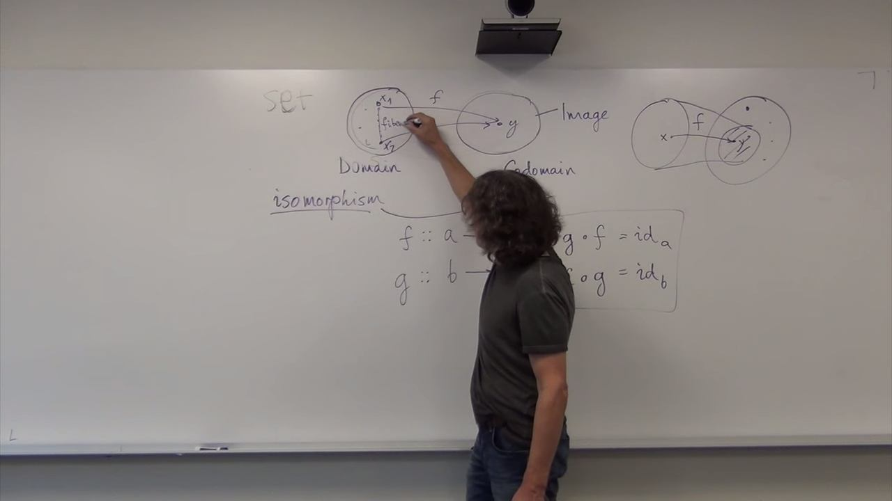
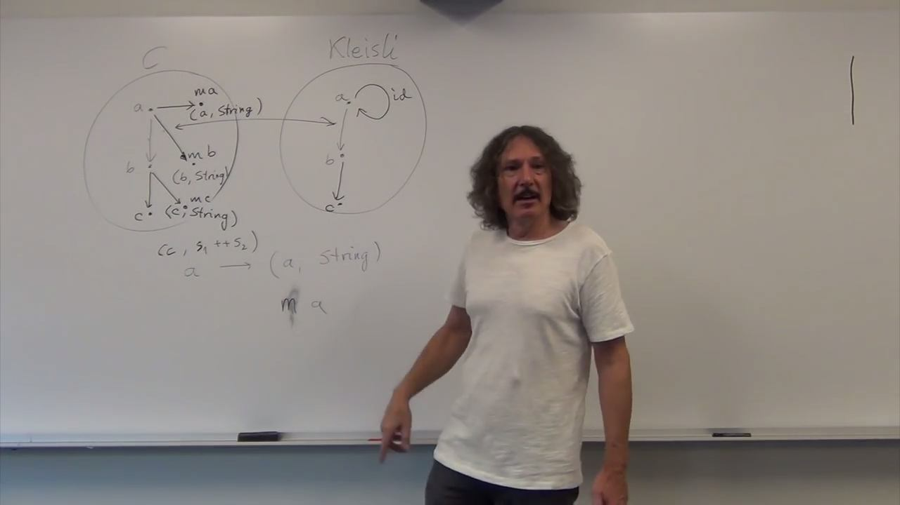
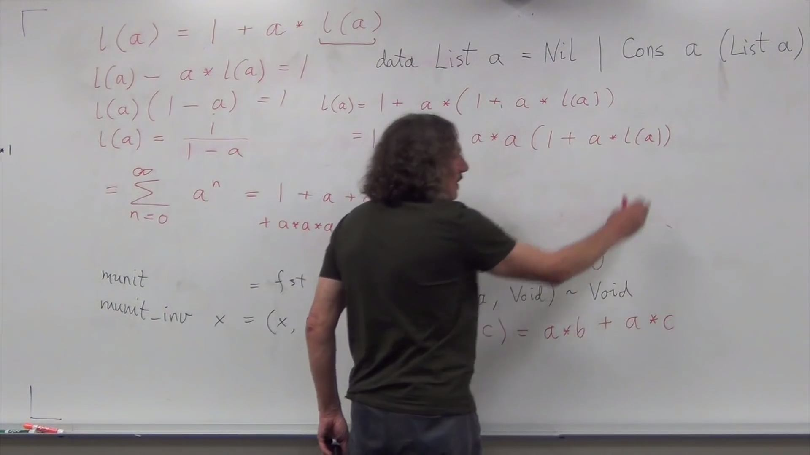
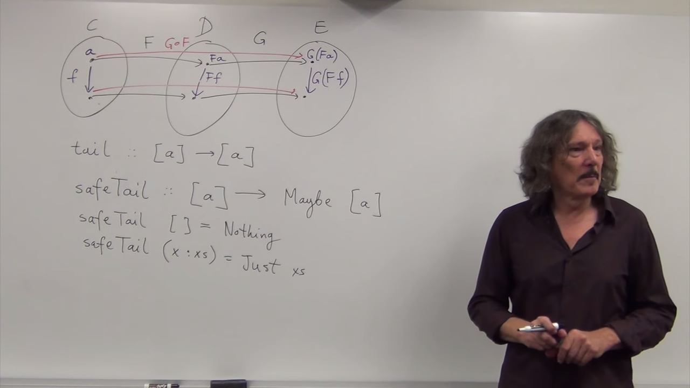
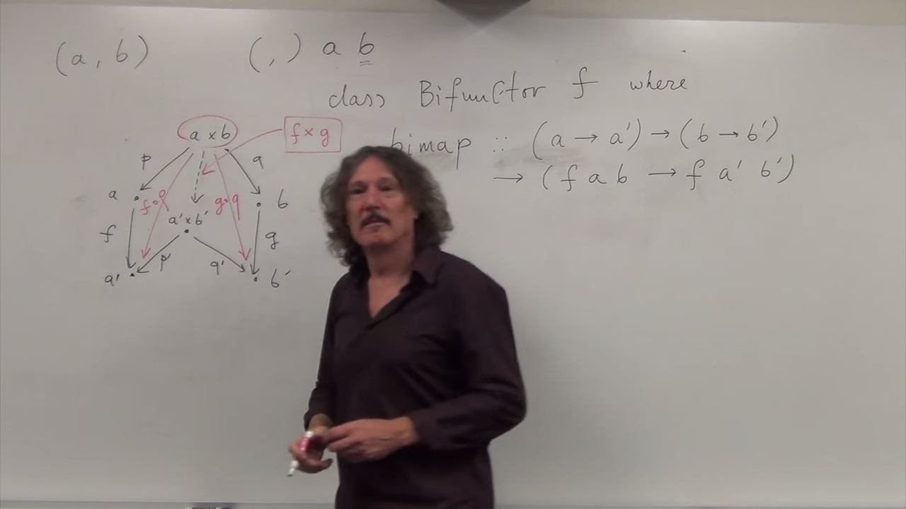
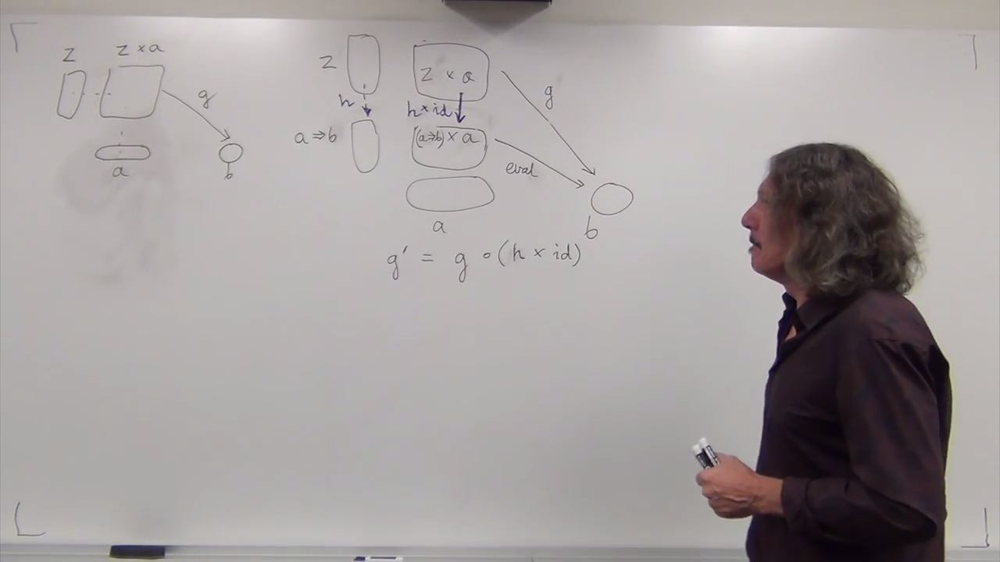
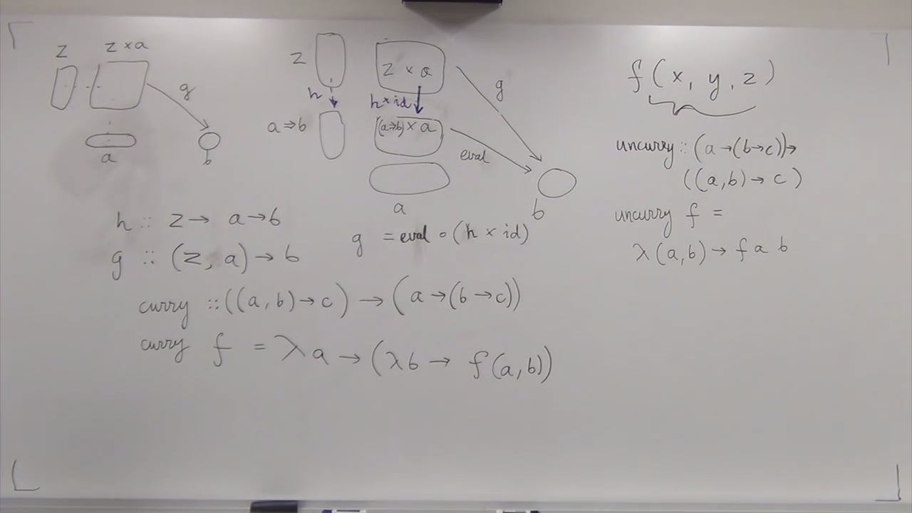
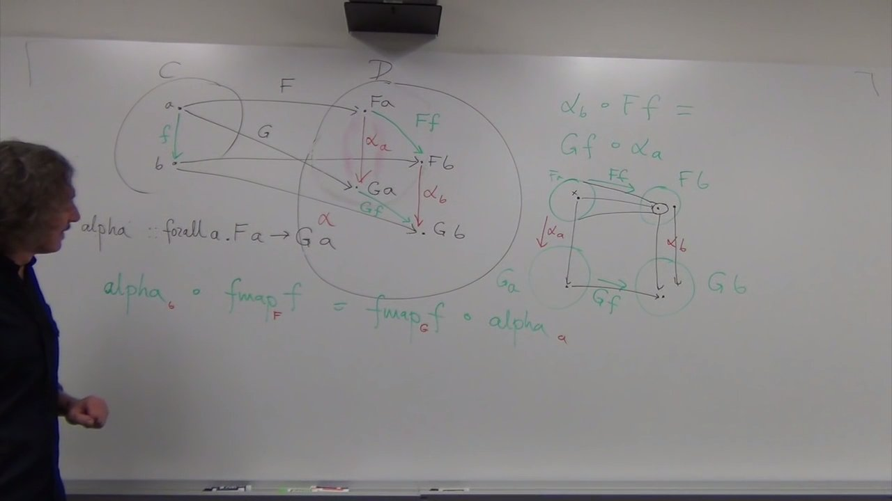
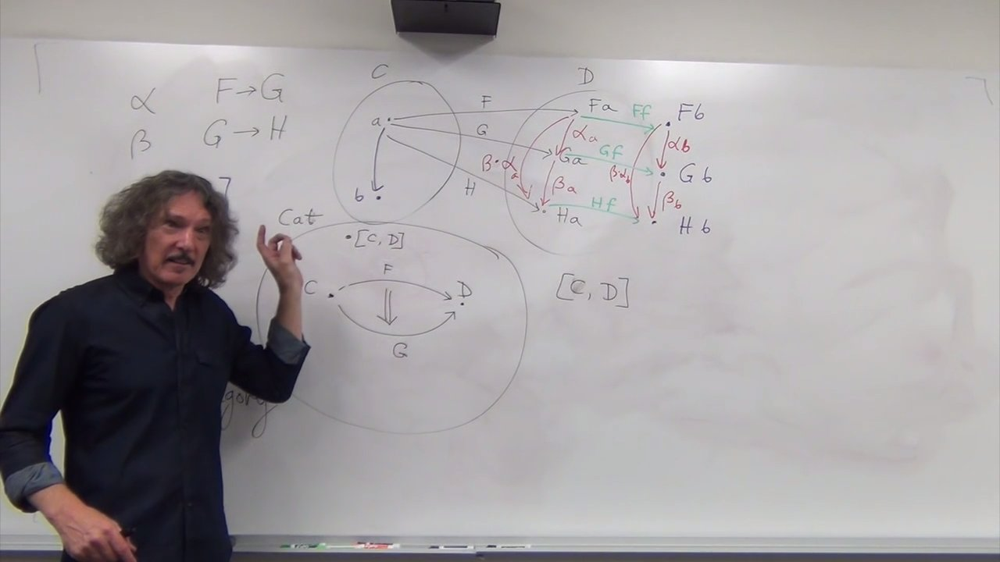

# Bartosz Milewski - Category Theory for Programmers I

Playlist: [click here](https://www.youtube.com/playlist?list=PLbgaMIhjbmEnaH_LTkxLI7FMa2HsnawM_)

***Category theory for programmers by Bartosz Milewski. Seattle, Summer 2016. Additional material [here](https://bartoszmilewski.com/2014/10/28/category-theory-for-programmers-the-preface/).***


## [1.1 Motivation and Philosophy](https://youtu.be/I8LbkfSSR58?list=PLbgaMIhjbmEnaH_LTkxLI7FMa2HsnawM_)


* Mostly familiar background


## [1.2 What is a category?](https://youtu.be/p54Hd7AmVFU?list=PLbgaMIhjbmEnaH_LTkxLI7FMa2HsnawM_)


* Mostly familiar background


## [2.1 Functions, epimorphisms](https://youtu.be/O2lZkr-aAqk)


* A good example of a function which can't be pure: `getchar()`. Think about memoising it.

* A [cute example](https://youtu.be/O2lZkr-aAqk?t=21m28s) of an isomorphism  between natural numbers and even numbers.
  - No [such isomorphism](https://youtu.be/O2lZkr-aAqk?t=22m28s) between natural numbers and real ones.

  Illustration of a fiber:
    

  FYI: Fiber product as defined in Spivak [p. 54]. Given the following relationships
  ```@mermaid
    graph TB;
    X--"f"--> Z;
    Y--"g"--> Z;
  ```
  the _fiber product_ is the set $
    X\times_Z Y := \{(x,z,y)\ |\ f(x) = z = g(y)\}.
  $
  Consolodating those ideas is interesting.

* > So if my microscope doesn't work, maybe my telescope will work.

  A [Cute idea](https://youtu.be/O2lZkr-aAqk?t=36m) and comment in reference to the idea that cetegory theory doesn't allow you to define relationships by the internal structore of the objects. So, things such as isomorphism must be defined looking outward, not inward, since we treat objects as points with no internal structure.

* A beautiful [discussion](https://youtu.be/O2lZkr-aAqk?t=36m49s) of how category theorists prefer greek roots, and have epic ↔ surjection and monic ↔ injection. Thus, epimorphisms and monomorphisms.

* The Wikipedia definition of [epimorphism](https://en.wikipedia.org/wiki/Epimorphism) is somewhat abstruse. I find Bartosz's [explanation](https://youtu.be/O2lZkr-aAqk?t=39m9s) illuminating.


## [2.2 Monomorphisms, simple types](https://youtu.be/NcT7CGPICzo)


* Bartosz gives a good [explaination](https://youtu.be/NcT7CGPICzo?t=1m42s)  of monomorphism, a la his explanation of epimorphism from the end of the last lecture.


## [3.1 Examples of categories, orders, monoids](https://youtu.be/aZjhqkD6k6w)


* How to build a category from any graph: [_free construction_](https://youtu.be/aZjhqkD6k6w?t=9m52s)

* NB: According to [Wikipedia](https://en.wikipedia.org/wiki/Posetal_category),
  > In mathematics, a posetal category, or thin category, is a category whose homsets each contain at most one morphism.

* NB: Preorders may be cyclic and not all objects may be connected, but all hom-sets contain at most one arrow. Partial orders are acyclic but still, not all elements may be comparable, and total orders are acyclic where exactly one arrow exists between all objects.

* Very nice [explanation](https://youtu.be/aZjhqkD6k6w?t=25m11s) of why epic monomorphisms (or monic epimorphisms?) aren't generally isomorphisms, despite the fact that bijections on sets are isomorphisms.

* [Monoid](https://youtu.be/aZjhqkD6k6w?t=32m47s)


## [3.2 Kleisli category](https://youtu.be/i9CU4CuHADQ)


* C\+\+ audit trail [example](https://youtu.be/i9CU4CuHADQ?t=9m14s).

* Functions where the return type is embelished (such as `a -> (b, string)`) are called Kleisli arrows.


## [4.1 Terminal and initial objects](https://youtu.be/zer1aFgj4aU)


* In **Set** there is no arrow from from a non-empty set to the empty set.

* In **Set**, the initial object is the empty set.

* For a category $\mathcal{C}$ a terminal object is the one for which $\forall (A\in\mathcal{C})\,\exists\, f: A\rightarrow()$ and $\forall (f, g)\ |\ f:A\rightarrow(), g: a\rightarrow() \Rightarrow f = g$.

* Video begins with a review of Kleisli category, which I find very effective. I prefer it to the one in the last video, though I think it is valuable to have them both.

* Final diagram in Kleisli discussion is a nice illustration of a monad.
  


## [4.2 Products](https://youtu.be/Bsdl_NKbNnU)


* `std::pair.first` is the projection function for the direct product.


## [5.1 Coproducts, sum types](https://youtu.be/LkIRsNj9T-8)


* A coproduct on sets gives a 'tagged union', also called a _variant_ which explains the C\+\+ naming `std::variant`. https://youtu.be/LkIRsNj9T-8?t=17m13s


## [5.2 Algebraic data types](https://youtu.be/w1WMykh7AxA)


* Relatively shocking [type-algebra example](https://youtu.be/w1WMykh7AxA?t=24m19s) of power series giving all possible lists:
  


## [6.1 Functors](https://youtu.be/FyoQjkwsy7o)


* A set is a category with only identity arrows. The elements of the set are objects of the category. It is called a discrete category.

* A category that is not discrete, has structure.

* Classes of functors:
  - Faithful functor: injective on hom-sets.
  - Full functor: surjective on hom-sets.
  - Fully faithful functor is bijective on hom-sets.
  - Constant functor, $\mathit{\Delta_C}$, maps all objects into a single fixed one, and all arrows into the indentity arrow of the fixed object.


## [6.2 Functors in programming](https://youtu.be/EO86S2EZssc)


* In Haskell, functors are defined as
  ```
  class Functor f where
    fmap :: (a->b) -> (f a -> f b)
  ```
  where `f` is a _type constructor_. That is, a function which takes types and returns a type. So, `f` could be the list type constructor:
  ```
  data List a = Nil | Cons a (List a)
  ```
  So, any algebraic data structure can be a functor, and one only need define `fmap`. For the list example
  ```
  fmap _ Nil = Nil
  fmap fn (Cons h t) = Cons fn (fmap fn t)
  ```
  or even
  `fmap = map`


* ["Type Tetris"](https://youtu.be/EO86S2EZssc?t=37m58s)

* The reader example wasn't landing well with me, even though I knew well what a functor is. It was because the `Reader` is a popular monad in Haskell, and was yet unfamilliar with it. Reading this [explanation](http://stackoverflow.com/a/14179721/1827360) of what `Reader` is on SE helped. Also, for later, read Bartosz's [blog post](https://bartoszmilewski.com/2014/01/14/functors-are-containers/) which is a literary distillate of this lecture.


## [7.1 Functoriality, bifunctors](https://youtu.be/pUQ0mmbIdxs)


* Nice illustration of functor composition:
  

* Composition of functors, in programming, is composition of `fmaps`.

* Products in $\mathbf{Cat}$ are straightforward, because objects in (small) categories form sets, so products of categories are just direct products of sets. Furthermore, you simply take the direct product of the hom-sets, and you get composition for free: $(f', g') \circ (f, g) = (f'\circ f,\ g'\circ g)$, which preserves identity, and so on.

* $\mathbf{Hask}\times\mathbf{Hask} = \mathbf{Hask}^2$.

* A [*bifunctor*](https://youtu.be/pUQ0mmbIdxs?t=33m58s) is a functor from a product category: $C\times D\rightarrow E$. Lifting on a bifunctor is done with a `bimap`. It lifts two functions at the same time.
  ```
  class Bifunctor f where
    bimap :: (a->a') -> (b->b') -> (f a b -> f a' b')

  ```
  

* In the [case of a sum category](https://youtu.be/pUQ0mmbIdxs?t=42m56s), still have a bifunctor. With `Either a b`, you give a function for each case.

* Categories that have a bifunctor are called monoidal categories.


## [7.2 Monoidal Categories, Functoriality of ADTs, Profunctors](https://youtu.be/wtIKd8AhJOc)

* **Got lost when we started talking about the reader functor. *Revisit soon.***

* Previously noted unit type for product in **Hask** was `()`, which was a terminal object. Terminal objects

* A monoidal category has a tensor product, $\oplus$ with a unit $1$. A monoidal category is also called a [tensor category](https://en.wikipedia.org/wiki/Monoidal_category)

* Define `Identity` and `Const` functors, and those can form the basis for any abstract data type. Therefore, all abstract data types are functors.

* [Contravairant functor](https://youtu.be/wtIKd8AhJOc?t=36m54s)


## [8.1 Function objects, exponentials](https://youtu.be/REqRzMI26Nw)


* Think about $(a\rightarrow b) \times a$:
  
  This diagram illustrates an equivalence of two ways of looking at function evaluation. Rewrite the botton equation as $g = \mathrm{eval} \circ (h\times \mathrm{id})$


* A function objection only exists when, for every possible pair of $z$ and $g$, there is a unique $h$.


* 

* [Functions as type exponentials](https://youtu.be/REqRzMI26Nw?t=34m9s)

* Type algebra takes place in a *Bi-Cartesian Closed Category* (BCCC). A [*Cartesian Closed Category*](https://youtu.be/REqRzMI26Nw?t=38m43s) is one with a product for all objects, and exponentials, and a terminal object. A BCCC is a CCC with coproducts and an initial object.

* Exponential notation $f : a \rightarrow b$ is type $b^a$, with $0 =$`Void` (the initial object) and $1 =$`()` (where `()` is unit), $2 =$`Bool` and so on.

* For examples, $a^0 = 1$ is `Void`$\rightarrow a \simeq ()$ (since there is only one way to map an empty set to a nonempty set). $1^a = 1$ since there is only one way to map unit to a set $a$.


## [8.2 Type algebra, Curry-Howard-Lambek isomorphism](https://youtu.be/iXZR1v3YN-8)


* $a^{b+c} = a^b\times a^c$ reads as `Either b c -> a = (b->a, c->a)`.

* $(a^b)^c = a^{b\times c}$ reads as `c->(b->a) ~ (b,c) -> a`. It's curryging!

* $(a\times b)^c = a^c\times b^c$ reads as `c->(a,b) ~ (c->a, c->b)`

* In terms of propositional logic, `true` corresponds to `()` and `false` to `Void`.

* In order for the pair `(a,b)` to be non-empty, the types must be non-`Void`. Likewise, for the conjunction $a \land b$ to be nonzero, both $a$ and $b$ must be non-false.

* In order for the disjucntion $a \lor b$ to be true, one must be non-false. Likewise, to construct the type `Either a b`, either `a` or `b` must be non-`Void`

* The logical implication $a\Rightarrow b$ is equivalent to the function type `a->b`. A value of `b` is constructable from a value of type `a` if `a` is non-`Void`.

* Modus ponens is function application `( (a->b), a ) -> b` or in logical terms $(a\Rightarrow b) \land a \Rightarrow b$

* In categorical terms `true` = `()` = terminal object.

  | Type           | Category       | Logic          |
  | :------------- | :------------- | :------------- |
  | `Void`         | Initial obj    | False          |
  | `()`           | Terminal obj   | True           |
  | `(a, b)`       | $a\times b$    | $a\land b$     |
  | `Either a b`   | $a+b$          | $a\lor b$      |
  | `a->b`         | $a^b$          |$a\rightarrow b$|


## [9.1 Natural transformations](https://youtu.be/2LJC-XD5Ffo)


* 

* This dude apparently specialises in using category theoretical results to optimise Haskell code: http://comonad.com/reader/2011/free-monads-for-less/

* [Here](https://youtu.be/2LJC-XD5Ffo?t=43m39s) Bartosz says that natural transformations are a waay of repackaging the contents of a container. In contrast, `fmap` lets you change the contents of a container. So, a Functor holds the container constant while the contents are changed, while natural transformations keep the data constant and change the container.

* Are all (polymetrically) polymorphic functions natural transformations? Not all, but most.

* In general, if you have a parimetrically polymorphic function from and algebraic data type to another algebraic data type, including conds functors, it's a natural transformation because algebraic data types are functors.

* Covariance/contravariance is a wrench in the gears, but there is a generalisations to cope.


## [9.2 Bicategories](https://youtu.be/wrpxBXXgLCI?t=1m17s)


* [Diagram chasing](https://youtu.be/wrpxBXXgLCI?t=7m32s)

* From [Wikipedia](https://en.wikipedia.org/wiki/2-category)
  > In category theory, a 2-category is a category with "morphisms between morphisms"; that is, where each hom-set itself carries the structure of a category. It can be formally defined as a category enriched over Cat (the category of categories and functors, with the monoidal structure given by product of categories).


* 
  [Description](https://youtu.be/wrpxBXXgLCI?t=15m11s): In **Set** we had functions that were objects in **Set**. In **Cat**, the category of functors between categories is in **Cat**.

* From [Wikipedia](https://en.wikipedia.org/wiki/Enriched_category)
  > In category theory, a branch of mathematics, an enriched category generalizes the idea of a category by replacing hom-sets with objects from a general monoidal category. It is motivated by the observation that, in many practical applications, the hom-set often has additional structure that should be respected, e.g., that of being a vector space of morphisms, or a topological space of morphisms. In an enriched category, the set of morphisms (the hom-set) associated with every pair of objects is replaced by an opaque object in some fixed monoidal category of "hom-objects". In order to emulate the (associative) composition of morphisms in an ordinary category, the hom-category must have a means of composing hom-objects in an associative manner: that is, there must be a binary operation on objects giving us at least the structure of a monoidal category, though in some contexts the operation may also need to be commutative and perhaps also to have a right adjoint (i.e., making the category symmetric monoidal or even symmetric closed monoidal, respectively)


## [10.1 Monads](https://youtu.be/gHiyzctYqZ0markdown )


*


## [10.2 Monoid in the category of endofunctors]()
