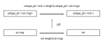
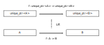
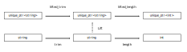

# Functional Patterns in C++
*A talk by Bartosz Milewski*

***Towards understanding asynchronous interfaces. First the introduction to some common functional patterns like Functor, which, surprisingly pops up everywhere. I'll show the example of a uninque_ptr and a vector as Functors. Of course, this is only in preparation for asynchronous functors***

Slides are [available here](https://www.fpcomplete.com/static/uploads/2012/09/Functional-Patterns.pdf).

## [1. Functors](https://youtu.be/ph7qt0pkPkc)

* Functional patterns have their basis in mathematics.
* Talk focuses toward creating a library to encapsulate asynchronous API.

#### Combinators:
  * AND combinator returns result after both functions finish (like wait for all)
    * Call the first one, wait for the result, then call the second one, combine results
    * Unless the functions have side effects the results are deterministic and independent of order.
    * AND combinators can be composed as long as return types are same. C# returns results in a vector.
    * Composition can be generalised to non-homogeneous types.

  * OR combinator returns the first result to finish.
    * Two calls started in parallel. When one returns, return the result.
    * Can't do this without threads. Problems terminating second thread after first returns.
    * Non-deterministic, unless both functions are guaranteed to return the same value.
    * OR combinators can be composed.

I've sort of already started using algebraic language to simplify what was said, but in the next slide, he points out that this is starting to look like algebra.

#### [Type Constructor Pattern](https://youtu.be/ph7qt0pkPkc?t=10m3s)

Type constructors are recipes for creating new types from old types. For any type `T`:
* `T*` is a pointer to `T`
* `T&` same as ptr, but ref
* `T[]`
* `T()` a function returning `T`
* `T(int)` A function taking an `int` and returning a `T`
* `T(*)()` A pointer to a function returning a `T`.

But templates allow us to create many type constructors.
* `unique_ptr<T>`
* `shared_ptr<T>`
* `vector<T>`
* `function<T()>`
* `pair<T,U>` - (binary type constructor, others are uniary or nullary)
* `function<T(int)>`

##### Hiding a value
Not sure this is a pattern, but Bartosz suggests it in a later sentence. He points out that type constructors such as `unique_ptr<T> p` hide a value, requiring you to access through an interface, such as `*p` or `p.get()`. Other examples include `vector<T> v` which gives indexed access or iterator access; and `function<T(int)> f` which gives access through the call operator.

#### [Functor pattern](https://youtu.be/ph7qt0pkPkc?t=16m3s)

A pattern for acting on hidden values. (Knowing what a functor is in category theory, I think it is a more general concept than this.)

**Note:** All of the code in this section seems to have errors, and perhaps is outdated. (For example, I've never seen `unique_ptr.assign()`.) I have fixed all of the code examples in the section.

**Example:** Given a function `int length(string)` and a `unique_ptr<string> p`, calculate the length of the string inside of `p`.
  * A very straightforward approach, just go through the interface:
    ```
    int len{-1}; // Will have to check len later, to see if we get a result
    if (p) len = length(p.get());
    ```
  * A more general way of doing it, avoiding
    ```
    unique_ptr<int> len; // nullptr
    if (p) len.assign( new int(length(p.get())) );
    ```
    (I found this didn't work, and used the code:
    ```
    std::unique_ptr<int> len;
    if (p) len = std::make_unique<int>(length(*p));
    ```
    )

More generally, we may lift the `length()` function to operate on the values abstracted behind unique_ptr.
```
// Corrected because the code in slides doesn't work.
unique_ptr<int> lifted_length(unique_ptr<string> s) {
  if (s)
    return move(make_unique<int>(length(*s)));
  else
    return move(make_unique<int>());
}
```
Graphically, the lifting does this:


But this is super clunky to have to write lifted versions of all of our functions. We can write an overload of fmap that will open the `unique_ptr`, apply a given function, and wrap the return value in a `unique_ptr`:

```
template<typename A, typename B>
unique_ptr<B> fmap( function<B(A)> f, unique_ptr<A> p ) {
  if (p)
    return move(make_unique<B>(f(*p)));
  else
    return move(make_unique<B>());
}
```
which looks graphically like so:



Here is my full code example:
```
#include <memory>
#include <string>
#include <iostream>

using namespace std;

template<typename A, typename B>
unique_ptr<B> fmap( function<B(A)> f, unique_ptr<A> p ) {
  if (p)
    return move(make_unique<B>(f(*p)));
  else
    return move(make_unique<B>());
}

int length(string s){
  return s.length();
}


int main() {
  auto p = make_unique<string>("Hello, World!");
  auto len = fmap<string, int>(&length, move(p));
  cout << *len << endl;
  return 0;
}
```

As a personal asside, a more modern version of getting this sort of 'maybe' behaviour is to use `std::optional` which is only available as of C++17. At the time of this writing, Clang has only experimental support for `std::optional` as `std::experimental::optional`. Here is an implimentation using optionals instead of unique_ptrs. It gets rid of all of the nasty moving.
```
#include <memory>
#include <string>
#include <iostream>
#include <experimental/optional>

using namespace std;
using namespace std::experimental;

template<typename A, typename B>
optional<B> fmap( function<B(A)> f, optional<A> p ) {
  if (p)
    return make_optional<B>(f(*p));
  else
    return {};
}

int length(string s){
  return s.length();
}


int main() {
  auto p = make_optional<string>("Hello, World!");
  auto noString = nullopt;
  // auto len = fmap<string, int>(&length, noString);
  auto len = fmap<string, int>(&length, p);
  cout << len.value_or(-1) << endl;
  return 0;
}
```
Finally, when I was first exposed to this example, I thought that there would be a function that would create function objects with lifted versions of functions. That isn't the way it went, but here is a version that does this, using the unique_ptr example:
```
#include <memory>
#include <string>
#include <iostream>

using namespace std;

template<typename A, typename B>
auto unique_ptr_lifter(function<B(A)> f) {
  return [&f](unique_ptr<A> p){
    if (p)
      return move(make_unique<B>(f(*p)));
    else
      return move(make_unique<B>());
  };
}

int length(string s){
  return s.length();
}


int main() {
  auto p = make_unique<string>("Hello, World!");
  auto lifted_length = unique_ptr_lifter<string, int>(&length);
  auto len = lifted_length(move(p));
  cout << *len << endl;
  return 0;
}
```
and using `std::optional`
```
#include <memory>
#include <string>
#include <iostream>
#include <experimental/optional>

using namespace std;
using namespace std::experimental;

template<typename A, typename B>
auto optional_lifter(function<B(A)> f) {
  return [&f](optional<A> p){
    if (p)
      return make_optional<B>(f(*p));
    else
      return optional<B>();
  };
}

int length(string s){
  return s.length();
}


int main() {
  auto p = make_optional<string>("Hello, World!");
  auto noString = nullopt;
  auto lifted_length = optional_lifter<string, int>(&length);
  // auto len = lifted_length(p);
  auto len = lifted_length(noString);
  cout << len.value_or(-1) << endl;
  return 0;
}
```
**Important notes:**
* This would probably all be better passing const references rather than copies. So, passing `const unique_ptr<A>&`
* The `fmap` version allows composition. For example, to trim the string:
```
auto count = fmap<string, int>(&length, fmap<string, string>(&trim, move(p)))
```
and looks like this:

* There is a great dirty side-effect in the unique_ptr version. IT DESTROYS THE UNIQUE_PTR THAT YOU PASS IN!

Finally, Bartosz shows that the same abstraction can be made to `std::vector<A>`, which will map the function over each element of the vector, and return a vector of the returned elements. That is, `fmap : (A -> B) -> A -> B`.


## [2. Currying, Applicative](https://youtu.be/Hx9jojeBj6w)

## [3. Async API, Monoid, Monad](https://youtu.be/ozN6XxsAF84)
