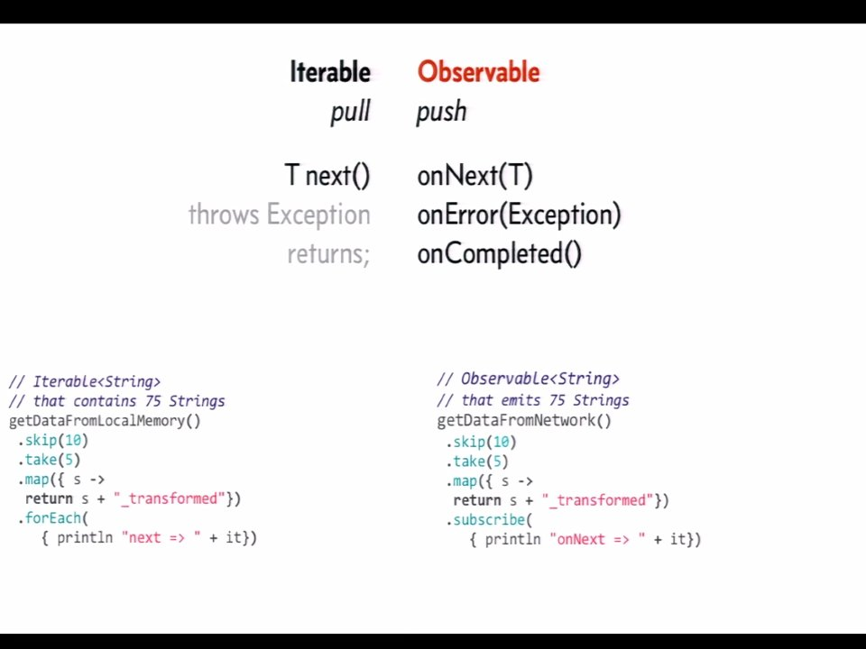
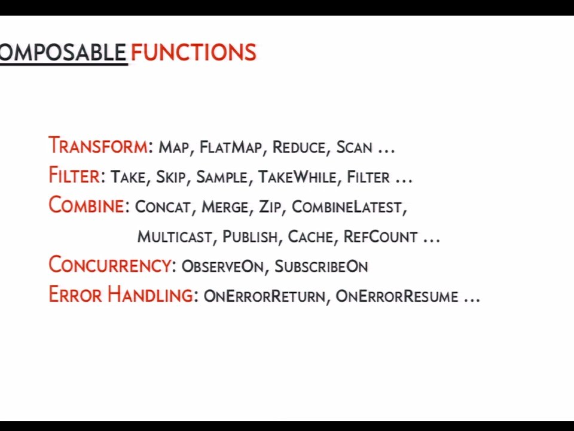
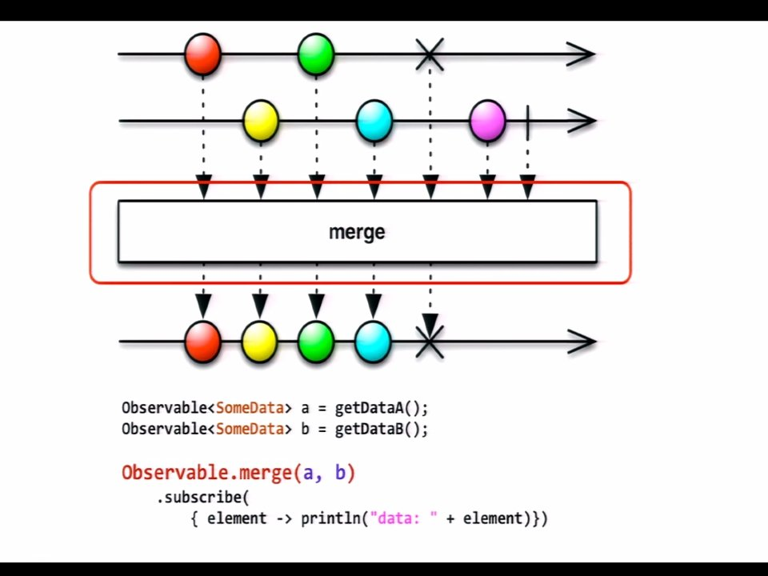
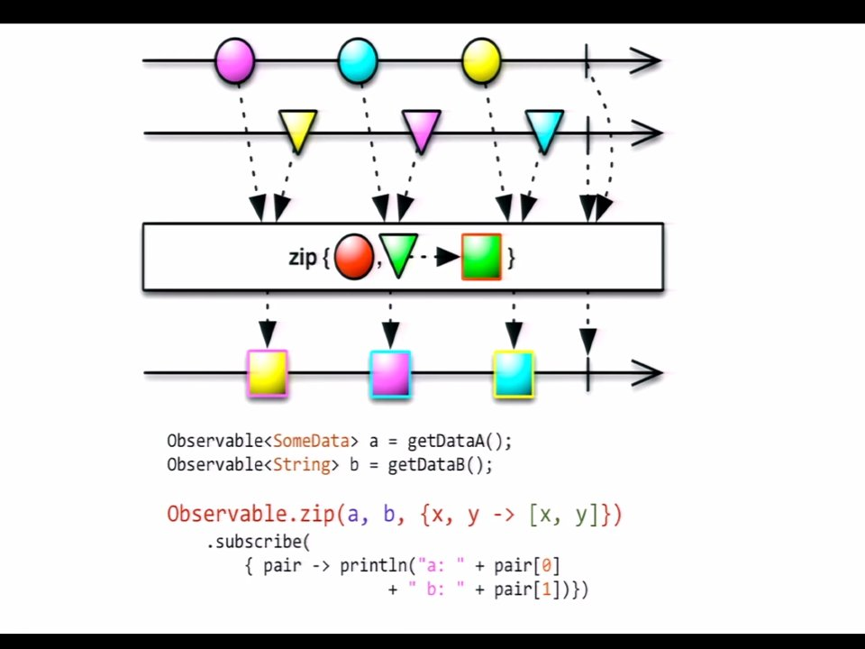

# Functional Reactive Programming with RxJava

Video URL: [https://www.youtube.com/watch?v=Dk8cR1Kxj0Y](https://www.youtube.com/watch?v=Dk8cR1Kxj0Y)

Talk by: Ben Christensen

Bio    : Ben Christensen is a software engineer on the Netflix API Platform team
responsible for fault tolerance, performance, architecture and scale while
enabling millions of customers to access the Netflix experience across more than
800 different device types. Specialising in Java since the 90s and through years
of web and server-side development Ben has gained particular interest and skill
in building maintainable, performant, high-volume, high-impact systems. Prior to
Netflix, Ben was at Apple in the iTunes division making iOS apps and media
available to the world. Open source contributions include Hystrix
(https://github.com/Netflix/Hystrix) and RxJava
(https://github.com/Netflix/RxJava).

## Important points

Erik Meijer history at [13:29](https://youtu.be/Dk8cR1Kxj0Y?t=13m29s).

Erik Meijer discovered that the dual of a pull-based iterable is push-based observable:

and all of the magic starts to happen when you apply higher order functions.

These are some higher order functions which can be composed over observables.

Marble diagrams seem like a great way to represent some of these things.

Marble diagram for `merge(.)` function:

Marble diagram for `zip(.)` function:

The video goes on to describe some more higher-order functions and some
specifics about the Netflix back-end. Come back to watch this when I'm more well
versed in FRP.
