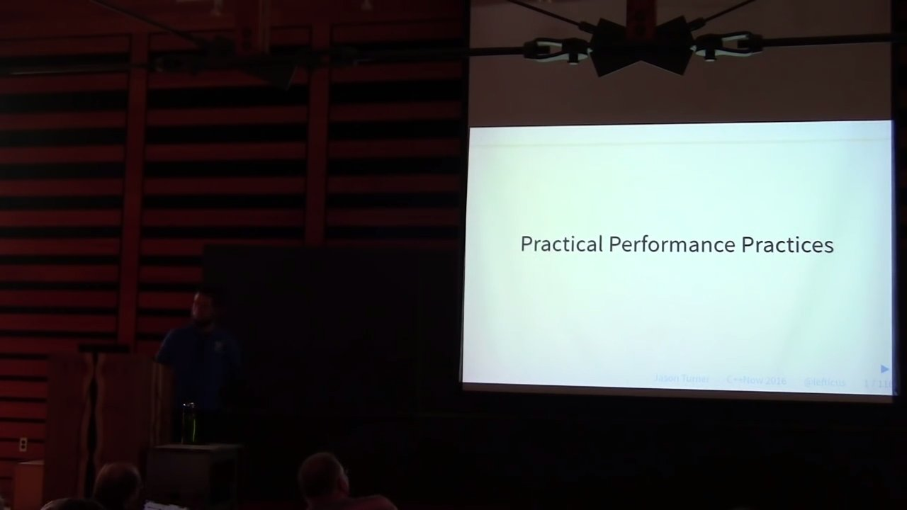

# Jason Turner: Practical Performance Practices

https://youtu.be/lNnBExDoNSQ

*A talk given at BoostCon 2016*

***Abstract—In the past 6 years ChaiScript's performance has been improved by nearly 100x. This was not accomplished by adding a virtual machine or performing dynamic recompilation. Instead, these increases have been accomplished by moving to more simple, cleaner, idiomatic C++ and by following some simple rules. We will outline these concepts with examples for how they both simplified code while improving performance.***



* A neat trick to avoid constructing and then assigning. Instead of:
  ```
  std::string s;
  select ( i % 4) {
    case 0:
      s = "string is mod 0"
    case 1:
      s = "string is mod 1"
      ...
  }
  ```
  use a lambda with Immediately-invoked Function Expressions (IIFE) idiom to construct in place, for a 30% performance gain:
  ```
  const std::string s = [&](){
    select ( i % 4 ) {
      case 0:
        return "string is mod 0";
      case 1:
        return "string is mod 1";
      ...
    }
  }();
  ```

* Should be using initialiser lists. But if not, and my constructor takes arguments by copy, then `std::move` the copy into place, rather than assign:
  ```
  struct Int {
    std::string m_s;

    Int(std::string t_s) : m_s(std::move(t_s)) {}

    // instead of
    // Int(std::string t_s) {m_s = t_s; }
  }
  ```

* C++ Core Guidelines stipulate that const methods should be thread safe.

* Unary plus operator on a lambda (with no capture) becomes a function pointer. ([53m40s](https://youtu.be/lNnBExDoNSQ?t=53m40s))

* Use the [`final`](http://en.cppreference.com/w/cpp/language/final) specifier when a virtual member won't be overridden again.

* ***Gotcha:*** when you have a virtual destructor, move construction and move assignment is implicitly disabled. Solution at [20:51](https://youtu.be/lNnBExDoNSQ?t=20m51s).
