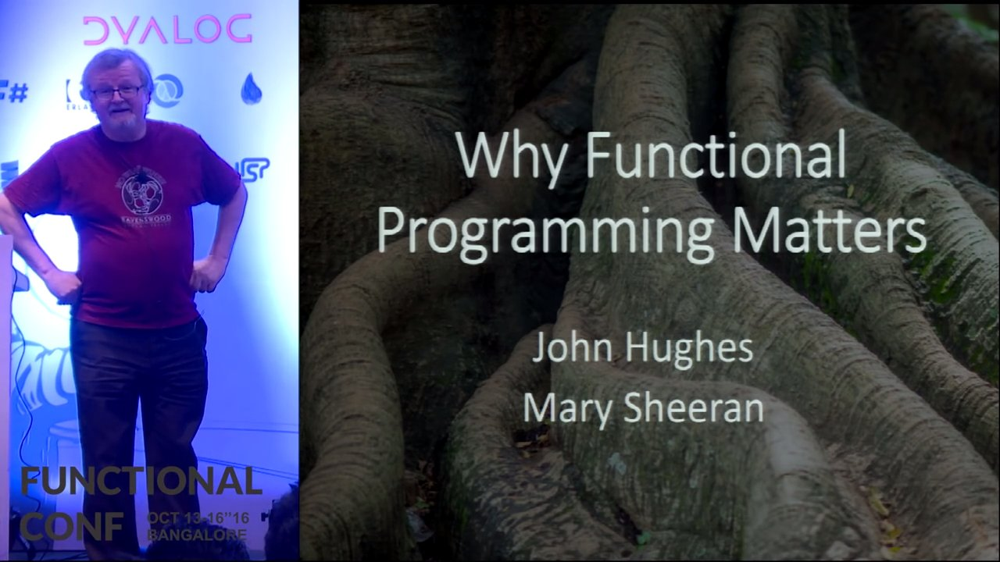

# John Hughes - Why Functional Programming Matters

*A talk given at Functional Conf 2016*

https://youtu.be/XrNdvWqxBvA?list=PL9Z-JgiTsOYTdi91N_DlcpWqkCYvMrhA4

* Functional programming started in the 1940s, but was very different than modern Haskell. It was comparatively minimalist.

* Hughes constructs a framework of functions that replace booleans and positive integers with functions. Says that any algebraic type can be entirely replaced by functions. This was the work of Alonzo Church who intended *Church  Encodings* with the goal of proving that functional programming could be a foundation for mathematics.

* Early versions of the Glasgow Haskell compiler actually implemented data-structures (not numbers and bools) using Church Encodings. For a while, in the early '70s, that was the fastest way. Johnne Fairbank re-implemented data-structures in a different Haskell compiler, and it actually ran slower than with Church encodings.

* Haskell encoding tricks work well in an untyped language, but type checkers will get wrecked on the type checking with recursive function calls. Haskell can do it with a bit of help. There is a line of Haskell code given that seems to clobber nested types of `a` into `a` (at [9m44s](https://youtu.be/XrNdvWqxBvA?t=9m44s)).

* During the 40s, functional programs could be written, but it wasn't until 1960, when [John McCarthy](https://en.wikipedia.org/wiki/John_McCarthy_(computer_scientist)) wrote the first Lisp implementation, that functional programs could be executed.

* In 1965, P. J. Landin wrote *The Next 700 Programming Languages*. Knew of 1,700 programming languages and thought that even 700 was too many. Developed the one to rule them all, called ISWIM (for *if you see what I mean*).
  - ISWIM was hugely influential as a functional language
  - Emphasized that structure leads to reason, and we should not rely on laws that are *almost* always true. This leads to the statement that
    > Expressive power should be by design, rather than by accident.

    meaning that having two ways to do the same thing because of asymmetry in laws is expressiveness of the language by accident.

* In 1977, John Backus won the Turing award for work leading to the first Fortran compiler. This was monumental, because it was the first program that could write better code than a human. It made high-level programming possible. In his award lecture/paper, he wrote not about Fortran, but a on the question "Can programming Be Liberated from the von Neumann Style? A Functional Style and Its algebra of Programs". He identifies several weaknesses of traditional prodecural programming. (Apparently, he may have been talking about Ada in particular.)
  - Inherent defects at the most basic level cause them to be both fat and weak.
  - Word-at-a-time style of programming (since our CPUs work on a word at a time.)
  - The inability to effectively use powerful combining forms for building new programs from existing ones. (such as `fmap`.)
  - Their lack of useful mathematical properties for reasoning about programs.
  > The fact that John Backus, the father of Fortran, devoted his Turing award lecture to a manifesto for functional programming inspired a generation of researchers—myself amongst them.

  - Download and read the first half of the paper.

* [Broad view of FP](https://youtu.be/XrNdvWqxBvA?t=28m30s):
  - Whole value programming
  - Combining forms
  - Algebra as a litmus test

* [USEFUL FOR OBSTACLE HANDLING](https://youtu.be/XrNdvWqxBvA?t=30m57s): Mark Jones represents shapes as functions from Point -> bool. Combinators are then extremely easy to define.

* [29:55](https://youtu.be/XrNdvWqxBvA?t=29m55s) Amazing story. Useful for talks. Darpa dismisses Haskell as a prototyping language as "Too cute for it's own good." and "Higher order functions just a trick, and probably not useful in other contexts."

* Intel bug, solved by `fl` a lazy functional language now used to prove correctness of all Intel hardware.

* Bluspec let's you write your FPGA architecture in Haskell and it transcribes to Verilog (often better than human written code).

* Functional programming [works by] simplifying the task, just making things work, giving designers more time to use better algorithms.
