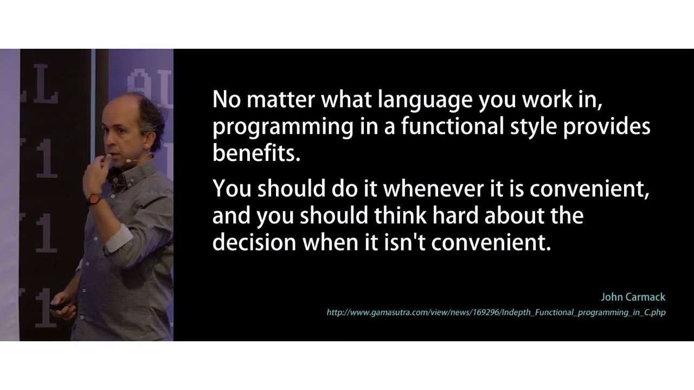
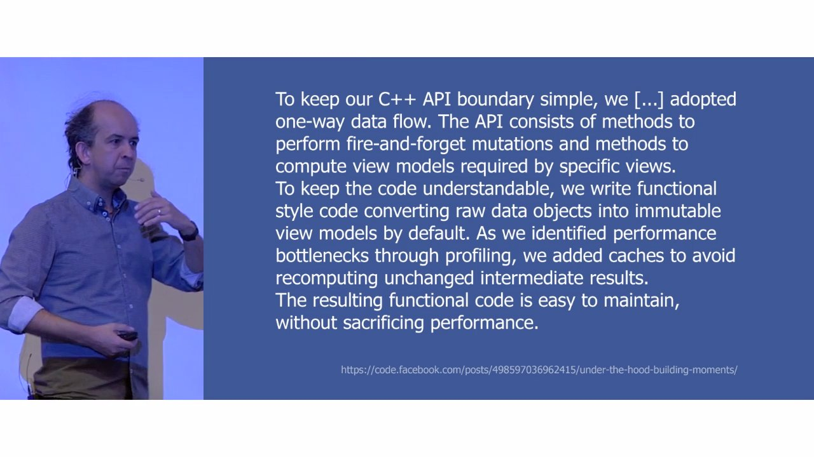
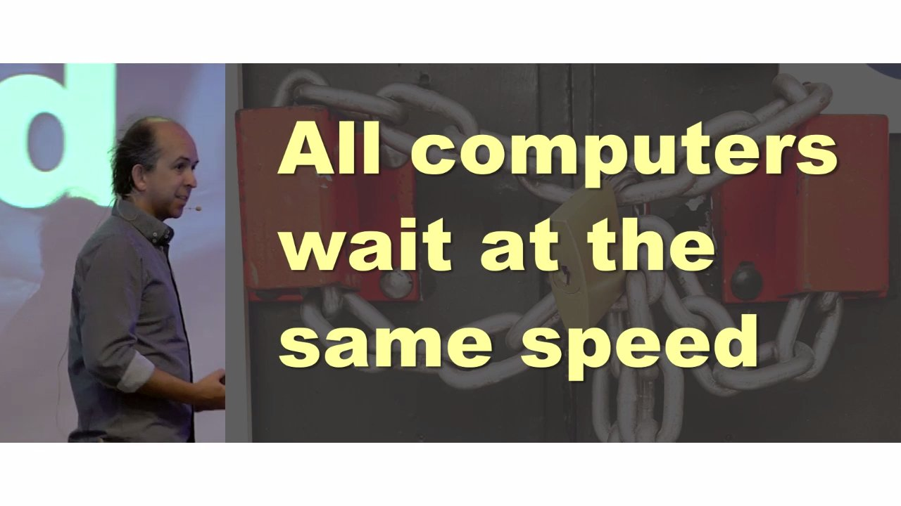
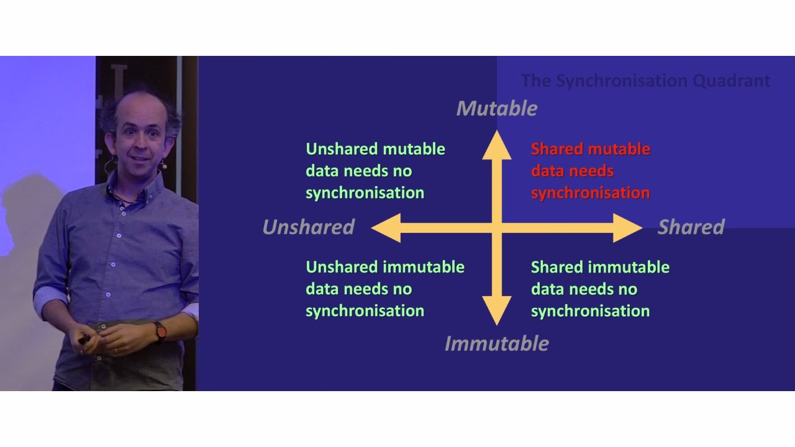
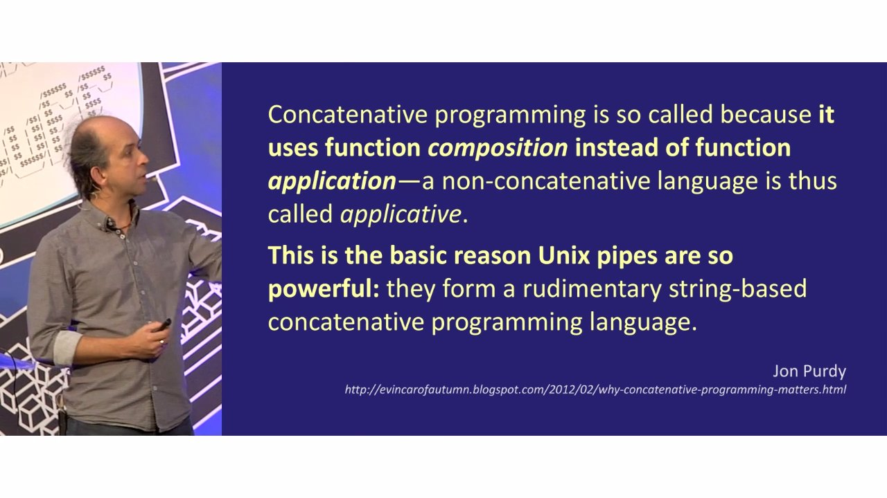
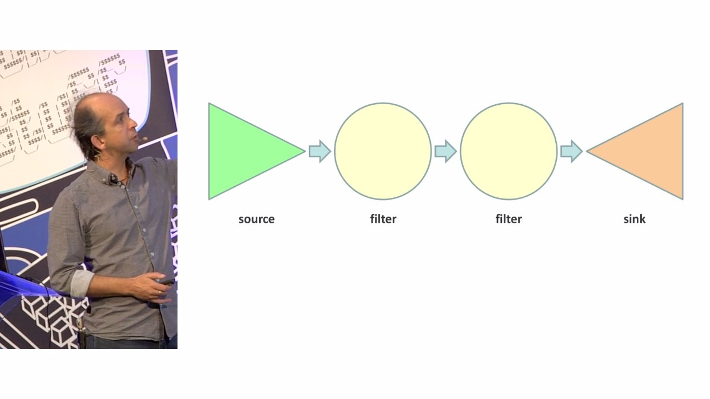

# Kevlin Henney - Functional C++

_Author bio:_ Kevlin is an independent consultant and trainer based in the UK.
His development interests are in patterns, programming, practice and process. He
has been a columnist for various magazines and web sites, including Better
Software, The Register, Java Report and the C/C++ Users Journal. Kevlin is
co-author of A Pattern Language for Distributed Computing and On Patterns and
Pattern Languages, two volumes in the Pattern-Oriented Software Architecture
series. He is also editor of 97 Things Every Programmer Should Know.



* Lambdas aren't only what makes functional programming. Lambda calculus from 1932. The idea of passing code around was around in Smalltalk-80 and ALGOL, precursors of C++ and C respectively.

* Facebook quote:




* Funny joke slide. Point out the following legal C++ syntax:
  ```
    [](){}
  ```
  A lambda that captures nothing, takes no arguments and does nothing. And this is how you run it:
  ```
    [](){}()
  ```

* Brilliant quote disparaging parallel bottlenecks, such as mutexes:
  ```
  \epigraph{
    All computers wait at the same speed.
  }{
    \EpiName{Kevlin Henney}
    \EpiBio{British software consultant and writer}
    \EpiSource{Talk given at Build Stuff 2016}
  }
  ```



* 

* Learn about [`std::condition_variable`](http://en.cppreference.com/w/cpp/thread/condition_variable). It's awesome.

* 

* Interesting channel model to solve FizzBuzz problem with a server. Locally each piece of code is sequential. Parallelism is a property that emerges from the structure.

  ```
  std:: string fizzbuzz(int n) {
    return
      n % 15 == 0 ? "FizzBuzz" :
      n % 3  == 0 ? "Fizz" :
      n % 5  == 0 ? "Buzz" :
        std::to_string(n);
  }

  void fizzbuzzer(channel<int> &in, channel<std::string> &out) {
    for (;;) {
      int n;
      in >> n;            // or in.receive(n);
      out << fizzbuzz(n); // or out.send(fizzbuzz(n));
    }
  }

  template <typename ValueType> class channel {
  public:
    void send(const ValueType &);
    void receive(const ValueType &);
    bool try_receive(ValueType &);

    void operator<<(const ValueType &to_send) { send(to_send) }
    receiving operator>>(ValueType &to_receive) {
      return reveiving(this, to_receive);
    }

  private:
    std::mutex key;
    std::condition_variable_any non_empty;
    std::queue<ValueType> fifo;
  };

  template <typename ValueType> class reveiving {
  public:
    reveiving(channel *that, ValueType &to_receive)
        : that(that), to_receive(to_receive) {}

    reveiving(reveiving &&other)
        : that(other.that), to_receive(other.to_receive) {
      other.that = nullptr;
    }

    operator bool() {
      auto from = that;
      that = nullptr;
      return from && from->try_receive(to_receive);
    }

    ~reveiving() {
      if (that)
        that->receive(to_receive);
    }

  private:
    channel *that;
    ValueType &to_receive;
  };

  int main() {
    channel<int> out;
    channel<std::string> back;
    std::thread fizzbuzzing(fizzbuzzer, out, back);
    for (int n = 1; n <= 100; ++n) {
      out << n; // or out.send(n);
      std::string result;
      back >> result; // or back.receive(result);
      std::cout << result << "\n";
    }
  }

  ```

* 

* A really cool example of [`std::any`](http://en.cppreference.com/w/cpp/utility/any) at [57:33](https://youtu.be/CIg6eyJv4dk?t=57m33s). I think I can find a good way to use this sort of message passing technique in control code.

* Learn more about [`std::ref`](http://en.cppreference.com/w/cpp/utility/functional/ref). Kevlin uses it in the phonebook code at [59:15](https://youtu.be/CIg6eyJv4dk?t=59m15s).

* Остранение—literally estrangement or "defamiliarisation". A term for an artistic technique of presenting to audiences common things in unfamiliar ways in order to enhance the perception of the familiar.
