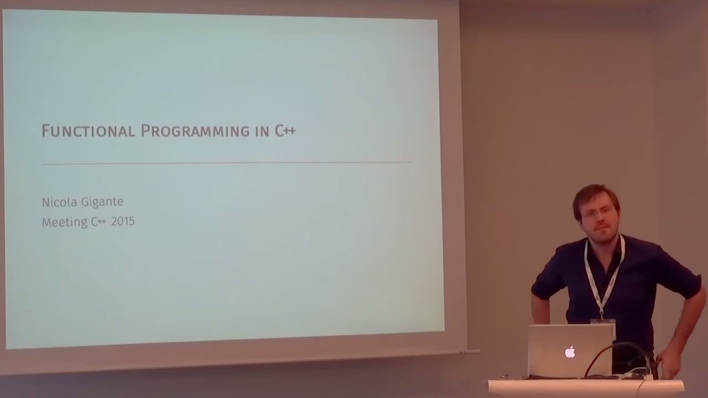

# Nicola Gigante - Functional Programming in C++

https://youtu.be/SCC23W3CQc8

*A talk given at Meeting C++ 2015*



Slides available: https://meetingcpp.com/index.php/tv15/items/1.html

* The standard library has functional-ish interface (passing in lambdas). There are very few classes meant to be derived from. Very few virtual or pure virtual members. "It seems the committee has forgotten how to object-orient the standard library."

* Object-oriented programming doesn't have solutions to important problems, such as
  - the composition of algorithms,
  - truly generic programming, without dependency issues, and
  - management of complexity in concurrent software.

* C++ is often thought of as O-O, but FP is not about language features, it's about a mental model for thinking about code. Aside: I like using Floyd's definition of paradigm for this purpose.

* C\++11 and C++14 introduce a number of language features which enable and ease the writing of FP abstractions.

* C++ lambas introduce no overhead.

* Limitations of lambas in C++11:
  - The couldn't have generic arguments. (That is, a templated `operator()`.)
  - Couldn't capture variables with move semantics. Only by copy or reference. (So, no unique pointers)
  - Anonymous type could not be named, so lambas could not be returned froma function!

* C++14 gives us lambdas with:
  - generic arguments,
  - automatic return type deduction, and
  - generalised capture lists.

Using `std::function` for type-erasure introduces overhead, but not more than any other language supporting lamdas.

* Functional style and higher order combinators are possible in C++ with things like lambdas, automatic type deduction, etc.

* C++ presents challenges sith copy/move semantics, perfect forward and alike.

* Libraries to reduce headaches: Boost.Fusion, Boost.Hana, Fit.

* Composition in this way was not possible in C++11 for lack of deduction:
  ```
  template <typename F> auto compose(F f) {
    return [=](auto x) { return f(x); };
  }

  template <typename F, typename... Fs> auto compose(F f, Fs... fs) {
    return [=](auto x) { return f(compose(fs...)(x)); };
  }
  ```

* Boost.Hana is cutting edge, and functional in nature. (Types cannot be mutated.) It provides a number of nice combinators.

* Boost.Hana allows currying in `hana::curry()`:
  ```
  auto f = curry([](int x, int y, int z) { return x * y * z; });

  auto s = f(4);
  auto t = f(5);
  auto 2 = f(6); // w = 26
  ```

* Overloaded function object, not possible in most functional languages:
  ```
  auto f = hana::overload( // T.T. call f doubleIt(.);
    [](std::string s) { return s + s; },
    [](auto        x) { return x * s; }
    );

  std::vector<T> v = ...;
  std::transform(begin(v), end(v), begin(v), f);
  ```

* Partial application for binary operators:
  ```
  // Another version of doubleIt:
  using hana::_;
  std::vector<int> v = {1, 2, 3};
  std::transform(begin(v), end(v), begin(v), _ * 2);
  ```

* Infix function application:
  ```
  std::sort(begin(v), end(v), [](int i, int j){
    return std::abs(i) > std::abs(j);
  });
  ```
  we write
  ```
    std::sort(begin(v), end(v), (_ < _) ^on^ &std::abs<T>);
  ```
  Apparently the `Fit` library has something similar.
    - Prefer function objects, which are easier to pass around:
      ```
      auto abs = [](auto x){ return std::abs(x); };
      std::sort(begin(v), end(v), (_ < _) ^on^ abs);
      ```
    which instantiates the template for `std::abs<T>` in the lambda. I worry about performance here.

* Fix point combinator, which apparently has many nice theoretical properties:
  ```
  auto fact = hana::fix( [](auto fact, auto n) -> int {
    if (n == 0)
      return 1;
    else
      return n * fact(n - 1);
  });
  ```
  Apparently the fix point combinator factors the recursion.

## Question period

  * Q: You've passed lambdas and functions by value. Wouldn't it make sense to perfectly forward them?
    - Yes, of course. I've chosen to make the code simple by omitting std::forward everywhere. In the std library, there is a convention to pass lambdas by value, since they are stateless most of the time, and nothing is copied anyway. The `std::ref` and `std::cref` wrappers are useful for forcing pass by referenc.

  * Q: 
