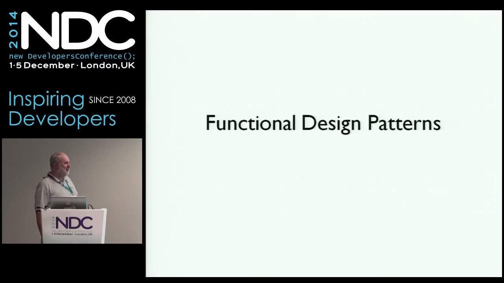

# Functional Programming Design

https://youtu.be/E8I19uA-wGY

***Abstract: In object-oriented development, we are all familiar with design patterns such as the Strategy pattern and Decorator pattern, and design principles such as SOLID. The functional programming community has design patterns and principles as well. This talk will provide an overview of some of these, and present some demonstrations of FP design in practice.***

