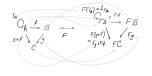
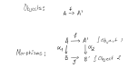
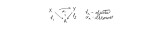
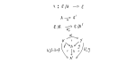
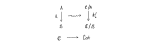
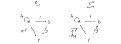
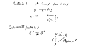

# Steve Awodey - Category Theory Foundations Lectures

Playlist: [click here](https://www.youtube.com/playlist?list=PL8Ky8lYL8-Oh7awp0sqa82o7Ggt4AGhyf)

***A series of lectures presented by [Steve Awodey](http://www.andrew.cmu.edu/user/awodey/) at the University of Oregon Programming Languages Summer School.***


## Lecture 1

https://youtu.be/ZKmodCApZwk

> Category theory is (to a first approximation) the abstract algebra of functions.

> The lambda calculus is a formal calculus for specifying, manipulating and calculating with functions.

There is a very deep connection between category theory and lambda calculus. They are two different views of the same thing. They are complimentary. The lambda calculus is more logical and syntactical as where category theory is algebraic with a more geometric aspect. The feed off of each other.

### Algebra of (abstract) functions

***Definition:*** Functions on sets: $A, B, C,\ldots$. A ***function*** $f:A\rightarrow B$ is a set $f \subseteq A\times B$, such that for all $a\in A$ there is a unique $b\in B$ such that the pair is an element of the relation: $(a,b) \in f$.

The basic operation that interests us in the definition of a category of functions is composition:
```@mermaid
graph LR
A --f--> B;
B --g--> C;
A --h--> C;
```
Where $h(x) = (g \circ f)(x)$ read as "h at x is g after f at x" or simply write $h = g\circ f$, since these are really sets. This composition follows two laws:
1. Composition is associative:
    ```@mermaid
    graph LR
    A --"(h∘g)∘f"--> D;
    A --f--> B;
    B --g--> C;
    B --"h∘g"--> D;
    C --h--> D;
    A --"h∘(g∘f)"--> D;
    A --"g∘f"--> C;
    ```
    so $(h \circ g)\circ f = h \circ (g\circ f)$.


2. Existance of identity:
    ```@mermaid
    graph LR
    A --"id_A"--> A;
    A--f-->B;
    B --"id_B"--> B
    ```
    So, $f\circ\mathrm{id}_A = f = \mathrm{id}_B \circ f$.

* ***Definition:*** a ***category*** consists of
  1. objects—sets like $A, B, C, \ldots$.
  2. arrows—morphisms $f, g, h, \ldots$ and for each arrow $f$, are given objects the domain and codomain so that $f:\mathrm{dom}(f)\rightarrow\mathrm{cod}(f)$.
  Additionally, categories fit the *axioms*:
    * For each object, $A$, there is an identity arrow $\mathrm{id}_A: A \rightarrow A$ that, for all $a\in A$, $\mathrm{id}_A(a) = a$.
    * Associative function composition operation for pairs of arrows where the codomain of one is the domain of the other.


* Partially ordered set example at [14m53s](https://youtu.be/ZKmodCApZwk?t=14m53s).

* Monoid example at [18m04s](https://youtu.be/ZKmodCApZwk?t=18m4s).

I found a nice bit about this on [this stack exchange post](http://math.stackexchange.com/a/1332726/49718):
>You already know that a monoid $M$ is a set with a unit $e$ and a binary operation. More precisely, if $a,b,c\in M$ then $$a\circ b\in M$$ $$(a\circ b)\circ c=a\circ (b\circ c)$$ $$e\circ a=a\circ e=a$$
>
>Now, take any category $C$ with one object, $c$. Since $C$ is a category, we need to say what the arrows are. That is, what the morphisms $c\rightarrow c$ are. There must be a unit $1_{c}:c\rightarrow c$, the arrows must be composeable and the composition must be associative. More precisely, if $f,g$ and $h$ are arrows, then $$f\circ g\in \text{Morph}(C)$$ $$(f\circ g)\circ h= f\circ (g\circ h)$$ $$1_{c}\circ f=f\circ 1_{c}=f$$Notice we are $\textit not$ talking about sets here. Just objects and arrows, in the abstract.
>
>But now if we just observe that the operations on $M$ are $\textit exactly$ the same as the operations on $\text{Morph}(C)$, we may regard the category $C$ as the monoid $M$. This correspondence is reversible: given category $C=\left \{ c \right \}$ we obtain a monoid $M$ whose elements are the arrows of $C$.
>
> Thus the two descriptions are equivalent.
>
> All this works because the binary operations are the same for both structures.

***Definition*** In any category, an ***isomorphism*** from $A\rightarrow^f B$ is a morphism which is inevitable:
```@mermaid
graph LR
A --"f"-->B
B --"g"--> A
A --"1_A"--> A
B --"1_B"--> B
```
such that $g \circ f = 1_A$ and $f \circ g = 1_B$.

Examples:
* Isomorphism in a PO-set are morphisms satisfying $p\leq q$ and $q\leq p$, so it is identity.
* A [profundity](https://youtu.be/ZKmodCApZwk?t=24m57s):
    > A group is a category with one object, and in which every arrow is an isomorphism
* > In **Set** isomorphisms are bijections of sets.

Examples of categories:
* In a monoid category, isomorphisms are elements with inverses.
* [Category of all posets](https://youtu.be/ZKmodCApZwk?t=25m53s)
    * A monotone map on a poset is a homomorphism. That is, a map $f$ is monotone if $p \leq q \ \Longrightarrow\ fp \leq fq$.
* [Category of monoids](https://youtu.be/ZKmodCApZwk?t=27m23s). Objects are all monoids and arrows are algebraic homomorphisms.

**NB:** Steve Awodey has a textbook available for free on the web [(click here)](https://people.mpi-sws.org/~dreyer/courses/catlogic/awodey.pdf).

* [Category of proofs.](https://www.youtube.com/watch?v=ZKmodCApZwk&feature=youtu.be&t=18m4s)

### [Constructios on Categories](https://youtu.be/ZKmodCApZwk?t=35m53s)

[***Definition:***](https://youtu.be/ZKmodCApZwk?t=41m8s) A ***functor*** $F:\mathcal{C}\rightarrow\mathcal{D}$ also has objects and arrows.
$$F_\text{Obj} : \text{Obj}(\mathcal{C})\rightarrow\text{Obj}(\mathcal{D})$$
$$F_\text{Morph} : \text{Morph}(\mathcal{C})\rightarrow\text{Morph}(\mathcal{D})$$
Graphically, this means:
  

Two categories $\mathcal{C}$ and $\mathcal{D}$.
* Category product: $\mathcal{C}\times\mathcal{D}$: The objects are pairs $(C,D)$ of the objects from the origininal categories. Arrows are pairs $(f,g):(C,D)\rightarrow(C',D')$. Identities are $1_{(C,D)} = (1_C, 1_D)$. Component-wise composition: $(f',g') \circ (f,g) = (f'\circ f, g'\circ g)$. This preserves all category axioms. This product comports with the notion of the group product.

  This product is a functor. It preserves domains and codomains, identities and so on.

* [The arrow category](https://youtu.be/ZKmodCApZwk?t=37m38s) $\mathcal{C}^\rightarrow$.
  
  The arrow category involves two functors. One for the domain and the other on the codmain of the category.


* [Slice category](https://youtu.be/ZKmodCApZwk?t=46m48s). Let $A$ bet an object of $\mathcal{C}$. The slice category is $\mathcal{C}/A$. It has as objects, arrows with $A$ as the codomain. As arrows, it has commutative triagles.
   

* Forgetful functor, which isn't clear to me from the explanation given. It goes from the slice category on $\mathcal{C}$ to $\mathcal{C}$ itself: $\mathcal{C}/A\rightarrow\mathcal{C}$. Since I didn't get it, here is the diagram he draws:
  

* [Fix](https://youtu.be/ZKmodCApZwk?t=51m58s) For each object in the category, you get a category. For each arrow, you get a functor. I'm lost at this point, so here's the board:
  

### [Duality](https://youtu.be/ZKmodCApZwk?t=1h4m32s)

For every category $\mathcal{C}$ there is a dial, or *opposite* $\mathcal{C}^\text{op}$. The objects and arrows in $\mathcal{C}^\text{op}$ are identical to $\mathcal{C}$, except the domain and codomains of the arrows are transposed. That is to say the arrows are reversed:

  

The concept may seem superficial, but its a formal relationship that has important uses.

* A contravariant functor is a functor on the dual category.

### [Examples of contravariant functors](https://youtu.be/ZKmodCApZwk?t=1h8m11s)

* Sets: for any two sets in the category of sets, you can build the set of all functions from one to the other. Sets $A, B$ and $B^A$ is the set of all functions from $A$ to $B$: $B^A = \{f:A\rightarrow B\}$. This is a functor in the argument $B$:
  * For fixed $A$, we get a functor $X^A \longrightarrow_{f_*} Y^A$ from $f:X\rightarrow Y$. So, given any $f$ from $X$ to $Y$, there is an induced map $f_*$
  

### [Representable functors](https://youtu.be/ZKmodCApZwk?t=1h12m3s)

We have objects $A,B\in\mathcal{C}$. The set of arrows from $A$ to $B$ in the category is $\text{Hom}_\mathcal{C}(A,B) = \{f:A\rightarrow B\}$ (Implicit assumption, is that $\mathcal{C}$ is small.) As before, we may fix $A$:
$$
  \text{Hom}_\mathcal{C}(A, \cdot) : \text{Hom}(A,X)\rightarrow\text{Hom}(A,Y)
$$
for any $X\rightarrow Y$, by composition. That's confusing (I think). But reasoning this out, the set $\text{Hom}_\mathcal{C}(A, \cdot)$ is the set of all arrows leaving $A$. It looks like he is saying that if I have a map from $X$ to $Y$, then I can compose it with the arrows leaving $A$ and going into $X$ to create $\text{Hom}(A,Y)$. That doesn't seem right to me, because there can be other paths between $A$ and $Y$ that don't go through $X$.

> The representable functor of $A$ is $\text{Hom}_\mathcal{C}(A, \cdot)$, and goes from $\mathcal{C}$ into the category of all sets. $$\text{Hom}_\mathcal{C}(A, \cdot) : \mathcal{C}\rightarrow\mathbf{Set}$$

Reflecting on my previous confusion, if $\cdot$ can loop through all objects in $\mathcal{C}$, then extending the previous reasoning between $X$ and $Y$, you can algorithmically map the network.

Now, fix the second argument of Hom:
$$
  \text{Hom}_\mathcal{C}(\cdot, B) : \text{Hom}(Y,B)\rightarrow\text{Hom}(X, B)
$$
So, now the map starts from $X$, goes to $Y$ and by composition, lands in $B$: $X\longrightarrow Y\longrightarrow B$ with composition giving $X\longrightarrow B$. This is the contravariant representable functor.
$$
  \text{Hom}_\mathcal{C}(\cdot, B) : \mathcal{C}^\text{op}\rightarrow\mathbf{Set}
$$

## Lecture 2
