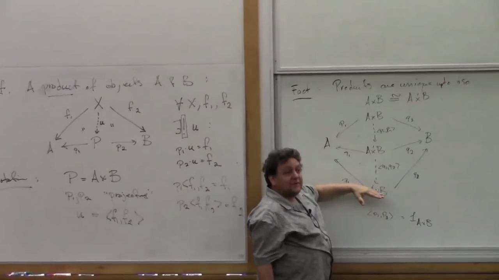

# Steve Awodey - Category Theory Foundations Lectures

Playlist: [click here](https://www.youtube.com/playlist?list=PL8Ky8lYL8-Oh7awp0sqa82o7Ggt4AGhyf)

***A series of lectures presented by [Steve Awodey](http://www.andrew.cmu.edu/user/awodey/) at the University of Oregon Programming Languages Summer School.***



## Lecture 1


https://youtu.be/ZKmodCApZwk

> Category theory is (to a first approximation) the abstract algebra of functions.

> The lambda calculus is a formal calculus for specifying, manipulating and calculating with functions.

A very deep connection exists between category theory and lambda calculus. They are two different views of the same thing. They are complimentary. The lambda calculus is more logical and syntactical as where category theory is algebraic with a more geometric aspect. The feed off of each other.


### [Algebra of (abstract) functions](https://youtu.be/ZKmodCApZwk?t=2m28s)


**[Definition:](https://youtu.be/ZKmodCApZwk?t=3m35s)** Functions on sets: $A, B, C,\ldots$. A ***function*** $f:A\rightarrow B$ is a set $f \subseteq A\times B$, such that for all $a\in A$ there is a unique $b\in B$ such that the pair is an element of the relation: $(a,b) \in f$.

The basic operation that interests us in the definition of a category of functions is composition:
```@mermaid
graph LR
A --f--> B;
B --g--> C;
A --h--> C;
```
Where $h(x) = (g \circ f)(x)$ read as "h at x is g after f at x" or simply write $h = g\circ f$, since these are really sets. This composition follows two laws:
1. Composition is associative:
    ```@mermaid
    graph LR
    A --"(h∘g)∘f"--> D;
    A --f--> B;
    B --g--> C;
    B --"h∘g"--> D;
    C --h--> D;
    A --"h∘(g∘f)"--> D;
    A --"g∘f"--> C;
    ```
    so $(h \circ g)\circ f = h \circ (g\circ f)$.

2. Existance of identity:
    ```@mermaid
    graph LR
    A --"id_A"--> A;
    A--f-->B;
    B --"id_B"--> B
    ```
    So, $f\circ\mathrm{id}_A = f = \mathrm{id}_B \circ f$.


* **[Definition:](https://youtu.be/ZKmodCApZwk?t=7m50s)** a ***category*** consists of
  1. objects—sets like $A, B, C, \ldots$.

  2. arrows—morphisms $f, g, h, \ldots$ and for each arrow $f$, are given objects the domain and codomain so that $f:\mathrm{dom}(f)\rightarrow\mathrm{cod}(f)$.
  Additionally, categories fit the *axioms*:
      * For each object, $A$, there is an identity arrow $\mathrm{id}_A: A \rightarrow A$ that, for all $a\in A$, $\mathrm{id}_A(a) = a$.
      * Associative function composition operation for pairs of arrows where the codomain of one is the domain of the other:

* Examples
  - [Partially ordered set.](https://youtu.be/ZKmodCApZwk?t=14m53s) A poset is a set and $\leq$ ordering operation: $(P, \leq)$. As an object in a category, there is at most one arrow between objects if one is leq the other: $p\rightarrow q\ \Longleftrightarrow\ p\leq q$.

    * The identity arrow exists because of the reflexivity of the operation: $p\rightarrow p$ because $p\leq p$.

    * Composition is satisfied because of the transitivity of ($\leq$): $p\leq q\wedge q\leq r \Longrightarrow\ p\leq r$:
      ```@mermaid
      graph LR
      p --> q
      q --> r
      p --> r
      ```

    * Unit and associativity laws hold for free:
      ```@mermaid
      graph LR
      p --> q
      q --> r
      r --> s
      p --> r
      p --> s
      q --> s
      ```
    * Similarly, the unit law will hold for free.

  This is an example of a category with few arrows and many objects. Few arrows, meaning at most one between any two objects.


  - A [monoid](https://youtu.be/ZKmodCApZwk?t=18m4s) $(M, \cdot, u)$ is an example of a category with few objects (only one) and many arrows. There is only a formal object (call it $\alpha$) and all of the arrows $\{e_1, e_2,\ldots\}$ are elements of $M$. So for all $m\in M$, $m:\alpha\rightarrow\alpha$.
    ```@mermaid
    graph TB
    α --"u"--> α
    α --"e1"--> α
    α --"e2"--> α
    α --"e…"--> α
    ```
    Composition of the arrows is the monoid operation. So, for any $m,n\in M$, those arrows are composed as $(m\cdot n):\alpha\rightarrow\alpha$. Since the domain and codomain are the same for all arrows, composition is straightforward. Since the monoid operation is associative, the associativity axiom for the category is satisfied. And since there is a unit element in $M$ under the monoid operation (by definition), then the unit axiom of the category is satisfied.
    - Any category with just one object is a monad, and any monad is a category with just one object. They are equivalent constructs.

NB(T.T.) I found a nice bit about this on [this stack exchange post](http://math.stackexchange.com/a/1332726/49718):
>You already know that a monoid $M$ is a set with a unit $e$ and a binary operation. More precisely, if $a,b,c\in M$ then $$a\circ b\in M$$ $$(a\circ b)\circ c=a\circ (b\circ c)$$ $$e\circ a=a\circ e=a$$
>
>Now, take any category $C$ with one object, $c$. Since $C$ is a category, we need to say what the arrows are. That is, what the morphisms $c\rightarrow c$ are. There must be a unit $1_{c}:c\rightarrow c$, the arrows must be composeable and the composition must be associative. More precisely, if $f,g$ and $h$ are arrows, then $$f\circ g\in \text{Morph}(C)$$ $$(f\circ g)\circ h= f\circ (g\circ h)$$ $$1_{c}\circ f=f\circ 1_{c}=f$$Notice we are $\textit not$ talking about sets here. Just objects and arrows, in the abstract.
>
>But now if we just observe that the operations on $M$ are $\textit exactly$ the same as the operations on $\text{Morph}(C)$, we may regard the category $C$ as the monoid $M$. This correspondence is reversible: given category $C=\left \{ c \right \}$ we obtain a monoid $M$ whose elements are the arrows of $C$.
>
> Thus the two descriptions are equivalent.
>
> All this works because the binary operations are the same for both structures.


**[Definition](https://youtu.be/ZKmodCApZwk?t=21m33s)** In any category, an ***isomorphism*** from $A\rightarrow^f B$ is a morphism which is inevitable:
```@mermaid
graph LR
A --"f"-->B
B --"g"--> A
A --"1_A"--> A
B --"1_B"--> B
```
such that $g \circ f = 1_A$ and $f \circ g = 1_B$.

Examples:
* In **Set** isomorphisms are bijections of sets.

* Isomorphism in poset are morphisms satisfying $p\leq q$ and $q\leq p$, so it is identity.

* A [profundity](https://youtu.be/ZKmodCApZwk?t=24m57s):
    > A group is a category with one object, and in which every arrow is an isomorphism

* An isomorphism in a monoid is an arrow with an inverse.

Examples of categories:
* In a monoid category, isomorphisms are elements with inverses.
* [Category of all posets](https://youtu.be/ZKmodCApZwk?t=25m53s)
    * A monotone map on a poset is a homomorphism. That is, a map $f$ is monotone if $p \leq q \ \Longrightarrow\ fp \leq fq$.
* [Category of monoids](https://youtu.be/ZKmodCApZwk?t=27m23s). Objects are all monoids and arrows are algebraic homomorphisms.

**NB:(T.T.)** Steve Awodey has a textbook available for free on the web [(click here)](https://people.mpi-sws.org/~dreyer/courses/catlogic/awodey.pdf).

* [Category of proofs.](https://www.youtube.com/watch?v=ZKmodCApZwk&feature=youtu.be&t=18m4s)


### [Constructios on Categories](https://youtu.be/ZKmodCApZwk?t=35m53s)


**[Definition:](https://youtu.be/ZKmodCApZwk?t=41m8s)** A ***functor*** $F:\mathcal{C}\rightarrow\mathcal{D}$ also has objects and arrows.
$$F_\text{Obj} : \text{Obj}(\mathcal{C})\rightarrow\text{Obj}(\mathcal{D})$$
$$F_\text{Morph} : \text{Morph}(\mathcal{C})\rightarrow\text{Morph}(\mathcal{D})$$
Graphically, this means:
  

Two categories $\mathcal{C}$ and $\mathcal{D}$.
* Category product: $\mathcal{C}\times\mathcal{D}$: The objects are pairs $(C,D)$ of the objects from the origininal categories. Arrows are pairs $(f,g):(C,D)\rightarrow(C',D')$. Identities are $1_{(C,D)} = (1_C, 1_D)$. Component-wise composition: $(f',g') \circ (f,g) = (f'\circ f, g'\circ g)$. This preserves all category axioms. This product comports with the notion of the group product.

  This product is a functor. It preserves domains and codomains, identities and so on.

* [The arrow category](https://youtu.be/ZKmodCApZwk?t=37m38s) $\mathcal{C}^\rightarrow$.
  
  The arrow category involves two functors. One for the domain and the other on the codmain of the category.


* [Slice category](https://youtu.be/ZKmodCApZwk?t=46m48s). Let $A$ bet an object of $\mathcal{C}$. The slice category is $\mathcal{C}/A$. It has as objects, arrows with $A$ as the codomain. As arrows, it has commutative triagles.
   

* Forgetful functor, which isn't clear to me from the explanation given. It goes from the slice category on $\mathcal{C}$ to $\mathcal{C}$ itself: $\mathcal{C}/A\rightarrow\mathcal{C}$. Since I didn't get it, here is the diagram he draws:
  

* [Fix](https://youtu.be/ZKmodCApZwk?t=51m58s) For each object in the category, you get a category. For each arrow, you get a functor. I'm lost at this point, so here's the board:
  

### [Duality](https://youtu.be/ZKmodCApZwk?t=1h4m32s)

For every category $\mathcal{C}$ there is a dial, or *opposite* $\mathcal{C}^\text{op}$. The objects and arrows in $\mathcal{C}^\text{op}$ are identical to $\mathcal{C}$, except the domain and codomains of the arrows are transposed. That is to say the arrows are reversed:

  

The concept may seem superficial, but its a formal relationship that has important uses.

* A contravariant functor is a functor on the dual category.

### [Examples of contravariant functors](https://youtu.be/ZKmodCApZwk?t=1h8m11s)

* Sets: for any two sets in the category of sets, you can build the set of all functions from one to the other. Sets $A, B$ and $B^A$ is the set of all functions from $A$ to $B$: $B^A = \{f:A\rightarrow B\}$. This is a functor in the argument $B$:
  - For fixed $A$, we get a functor $X^A \longrightarrow_{f_*} Y^A$ from $f:X\rightarrow Y$. So, given any $f$ from $X$ to $Y$, there is an induced map $f_*$
  

### [Representable functors](https://youtu.be/ZKmodCApZwk?t=1h12m3s)

We have objects $A,B\in\mathcal{C}$. The set of arrows from $A$ to $B$ in the category is $\text{Hom}_\mathcal{C}(A,B) = \{f:A\rightarrow B\}$ (Implicit assumption, is that $\mathcal{C}$ is small.) As before, we may fix $A$:
$$
  \text{Hom}_\mathcal{C}(A, \cdot) : \text{Hom}(A,X)\rightarrow\text{Hom}(A,Y)
$$
for any $X\rightarrow Y$, by composition. That's confusing (I think). But reasoning this out, the set $\text{Hom}_\mathcal{C}(A, \cdot)$ is the set of all arrows leaving $A$. It looks like he is saying that if I have a map from $X$ to $Y$, then I can compose it with the arrows leaving $A$ and going into $X$ to create $\text{Hom}(A,Y)$. That doesn't seem right to me, because there can be other paths between $A$ and $Y$ that don't go through $X$.

> The representable functor of $A$ is $\text{Hom}_\mathcal{C}(A, \cdot)$, and goes from $\mathcal{C}$ into the category of all sets. $$\text{Hom}_\mathcal{C}(A, \cdot) : \mathcal{C}\rightarrow\mathbf{Set}$$

Reflecting on my previous confusion, if $\cdot$ can loop through all objects in $\mathcal{C}$, then extending the previous reasoning between $X$ and $Y$, you can algorithmically map the network.

Now, fix the second argument of Hom:
$$
  \text{Hom}_\mathcal{C}(\cdot, B) : \text{Hom}(Y,B)\rightarrow\text{Hom}(X, B)
$$
So, now the map starts from $X$, goes to $Y$ and by composition, lands in $B$: $X\longrightarrow Y\longrightarrow B$ with composition giving $X\longrightarrow B$. This is the contravariant representable functor.
$$
  \text{Hom}_\mathcal{C}(\cdot, B) : \mathcal{C}^\text{op}\rightarrow\mathbf{Set}
$$

## Lecture 2

> a *universal mapping property* is a way of using the language of category theory.to give a characterisation or definition or specification of a structure or structured object that is unique up to an isomorphism. It picks out certain kinds of structure in terms of its mappings to other objects in a category.

Perhaps the first example, historically, of such a thing is the definition of the product of two objects in a category, that was given by Mac Lane, c. 1949.

In any category, a product $P$ of two objects, $A$ and $B$, consists of the following:
```@mermaid
graph TB
X --"f1"--> A
X -."u".-> P
X --"f2"--> B
P --"p1"--> A
P --"p2"--> B
```
where there is a unique map $u$ from $X$ into $P$ such that the two triangles (sides of this wonky hump) commute: $p_1\circ u = f_1$ and $p_2\circ u = f_2$. The arrows $p_1$ and $p_2$ are projections from the product $P=A\times B$ back into the objects $A$ and $B$ respectively. The mapping $u$ as defined by $f_1$ and $f_2$ is written notationally as $u = \langle f_1, f_2 \rangle$.

NB(T.T.): In the Steven Roman lectures, Lecture 1 or 2, I have written a similar definition (perhaps not as good as this one), but with a nicer hand-drawn diagram. Mermaid was impressive though, considering it wasn't meant for these sorts of things.

* Awodey [proves](https://youtu.be/TQYjekxqw-Q?t=3m20s) using diagrams and comutative relationships that products are unique up to isomorphism.

* Examples:
  - Sets: in sets, the product of two sets is the Cartesdian product: $A\times B = \bigl\{(a, b) | a\in A,\ b\in B\bigr\}$ with the usual projectsions $\pi_1(a,b) = a$ and $\pi_2(a,b) = b$.

  - We have similar concepts for topological spaces, posets, …

  - Posets for example. For posets $P$ and $Q$, we have $P\times Q = \bigl\{ (p, q) | p\in P, q\in Q\bigr\}$ ordered so that $(p,q) \le (p',q')\  \Longleftrightarrow\ p \le p' \wedge q \le q'$. Confirm this using the universal property.
    ```@mermaid
    graph TB
    X --"f1"--> P
    X -."u".-> PxQ
    X --"f2"--> Q
    PxQ --"p1"--> P
    PxQ --"p2"--> Q
    ```
    * First, denonstrate that the projections $p_1$ and $p_2$ are monotone. This is true because of the ordering property $(p,q) \le (p',q')\  \Longleftrightarrow\ p \le p' \wedge q \le q'$. That is, if one element of the product is LEQ another, then each of the projections will stand in the same relation. Having confirmed monotonicity, we know the portion of the graph projecting $P\times X$ onto $P$ and $Q$ is a good diagram in the category of posets.

    * Finally choose $u$ and verify that it is monotone. We choose the set theoretic pairing, $(f_1, f_2)$. Now check, $$(f_1, f_2)(x) \leq (f_1, f_2)(y)$$ for $x\leq y$. Expanding the inequality of pairs, we get
      $$
        (f_1\,x, f_2\, x) \leq (f_1\, y, f_2\, y)
      $$
      which is only satisfied when $f_1\, x\leq f_1\, y$ and $f_1\,y\leq f_2\,y$. But that follows from the fact that $f_1$ and $f_2$ are monotone, by definition, since $X$ was a poset. QED.

  - Another example is the category product (defined in Lec 1, under § on constructions) which is the direct product of the collections of objects and the direct product of the collections of arrows.

  - Group product or monoid product.

  - Look at another poset example, but not a product in a cetgory of posets, but a product within a poset $P$, with elements $x,y,z,\ldots\in P$. NB(T.T.) I'll skip this for now.


### [Duality](https://youtu.be/TQYjekxqw-Q?t=22m58s)


What is a coproduct?

> By general rules of concept formation in category theory, you add the prefix *co* to mean it's a product in the opposite category.

So, a coproduct will have a property like the universal property, but with arrows reversed. The *injections* $i_1$ and $i_2$ map the sets $A$ and $B$ into the coproduct:
```@mermaid
graph TB
A --"i1"--> A+B
B--"i2"-->A+B
A --"f1"--> X
A+B -."u".-> X
B --"f2"--> X
```
The proof of the universal property for products is equivalent to this dual proof because the only things that have changed are the directions of the arrows. That's the point of duality: you only have to prove something for one of them and you get the other for free.

++Fact:++ $A\times B \simeq B\times A$ by the twist morphism $\langle p_2, p_1\rangle$. (T.T. twist morphism is sort of my terminology, though Awody does call it a sort of twist.) So, by duality, $A+B \simeq B+A$. (He doesn't say so, but presumably twisting the injection functions gets you this morphism?)

Products are associative to an isomorphism:
$$
  A\times (B\times C) \simeq (A\times B)\times C,
$$
so by duality:
$$
  A + (B + C) \simeq (A + B) + C.
$$

[Examples of coproducts:](https://youtu.be/TQYjekxqw-Q?t=27m33s)
* In sets, $A+B$ is the disjoint unition.
* In posets, topological spaces, coproducts exist and are built in a similar way.
* In groups and monoids, they are more complicated. Sometimes written in the form of a tensor product $\otimes$ because you need to take the operations into account and do some extra stuff.
* [Coproduct in a poset](https://youtu.be/TQYjekxqw-Q?t=29m46s).


### [Exponential](https://youtu.be/TQYjekxqw-Q?t=32m6s): Another Example of a Universal Mapping Property


Suppose the category $\mathcal{C}$ contains all products.
> That means for any two objects, I can find a product.

Then, for $A, B\in\mathcal{C}$, the exponential is a structure with an object $B^A$ together with a map $B^A\times A\rightarrow_\epsilon B$ with the following universal mapping property.
