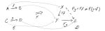

# Steven Roman - Introduction to Category Theory Lectures

Playlist: [click here](https://www.youtube.com/playlist?list=PLiyVurqwtq0Y40IZhB6T1wM2fMduEVe56)

***A series of lectures presented by the mathematician [Steven Roman](www.sroman.com)***

## [Lecture 1](https://youtu.be/If6VUXZIB-4)

Five basic concepts in category theory:
* categories
* functors
* natural transformations
* universality
* adjoints

Classes are more general sets. All sets are classes, but not all sets are classes. A class cannot be a member of a class. So, there is no set of all sets (because of some well known paradoxes), but there is a class of all sets.

From Wikipedia entry for [Class](https://en.wikipedia.org/wiki/Class_(set_theory)):
> The paradoxes of naive set theory can be explained in terms of the inconsistent assumption that "all classes are sets". With a rigorous foundation, these paradoxes instead suggest proofs that certain classes are proper (i.e., that they are not sets). For example, Russell's paradox suggests a proof that the class of all sets which do not contain themselves is proper, and the Burali-Forti paradox suggests that the class of all ordinal numbers is proper. The paradoxes do not arise with classes because there is no notion of classes containing classes. Otherwise, one could, for example, define a class of all classes that do not contain themselves, which would lead to a Russell paradoxes for classes.

***Definition:*** A ***category***, $\mathcal{C}$, consists of the following:
 1. A class $\text{Obj}(\mathcal{C})$ of objects. Notation: instead of writing $A\in \text{Obj}(\mathcal{C})$, we right $A\in\mathcal{C}$.

 2. For each pair of objects $A, B\in\mathcal{C}$ there exists a *set* called the *hom* set for $(A, B)$, $\hom_\mathcal{C}(A,B)$. The elements of a homeset are called *morphisms*, *maps* or *arrows*.
    * NB: $\hom(A,B) \neq \hom(B,A)$.
    * We use function notation, but morphisms need not be functions. For example, $f\in\hom(A,B)$ is a morphism $f:A\rightarrow B$, with domain $A$ and codomain $B$.
    * A non-standard notation that is used in this series: a shorthand for $f:A\rightarrow B$ is $f_{AB}$.

 3. Not a universal condition, but by convention: distinct hom sets are disjoint.

 4. Composition of morphisms: if $f:A\rightarrow B$ and $g:B\rightarrow C$ then $g\circ f: A\rightarrow C$ s.t. $f\circ(g\circ h) = (f\circ g) \circ h$ (that is, composition is associative). Composition on works with alignment of domains and codomains. In a composition of a pair, the codomain of one must be the domain of the other.

 5. Identity morphisms: for each $A\in\mathcal{C}$ there exists $1_A: A \rightarrow A$ for which $1_B \circ f_{AB} = f_{AB} \circ 1_B = f_{AB}$
    * Notation: the class of morphisms in $\mathcal{C}$: $\text{Mor}(\mathcal{C})$. If hom-classes are used instead of hom sets, then when the hom classes are in fact hom sets for a particular category, that category is said to be ***locally small***. Sets are thought of as smaller than classes in general. The lecturer specifies that all hom classes have to be hom sets, so all "of our" categories are locally small.
    * Notation: if $\text{Obj}(\mathcal{C})$ and $\text{Mor}(\mathcal{C})$ are sets, then $\mathcal{C}$ is said to be a ***small category***.

### [Examples](https://youtu.be/If6VUXZIB-4?t=25m8s)

* Sets. $\text{Obj}(\text{sets}) = \text{all sets}$.  $\text{Mor}(\text{sets}) = \text{set functions}$. (Usually never intrested in the class of all morphisms in a category. Focus locally on hom-sets between two specific objects.) $\hom(A,B) = \{\text{set functions from\ } A \text{\ to\ } B\}$.

* Grps (Groups). Objects is the class of all groups, and the hom-set $\hom(G,H)$ are the group homomorphisms from $G$ to $H$.

* AbGrps (abelian groups). Same as groups, but the objects are only abelian.

* $\text{Mods}_R$ (Modules over a ring). Objects are R-modules and morphisms are R-maps.

* $\text{Vect}_F$ (vector spaces over a field.) The morphisms are the linear transformations.

* …

* Fields - morphisms are ring embeddings

* Posets - objects are the class of all partially ordered sets and the morphists are monotone maps: $a \leq b \ \Longrightarrow\ fa\leq fb$ (maps preserving inequality structure).

* …

### [More unusual Examples](https://youtu.be/If6VUXZIB-4?t=30m24s)

* Matricies over a field

* Monoids - a category with no objects, and the morphisms are the elements of the set, which are built up by composition. So the morphism $1: \bullet\rightarrow\bullet$ can be composed with itself to make $2:\bullet\rightarrow\bullet$.

   I found a nice bit about this on [this stack exchange post](http://math.stackexchange.com/a/1332726/49718):
>You already know that a monoid $M$ is a set with a unit $e$ and a binary operation. More precisely, if $a,b,c\in M$ then $$a\circ b\in M$$ $$(a\circ b)\circ c=a\circ (b\circ c)$$ $$e\circ a=a\circ e=a$$
>
>Now, take any category $C$ with one object, $c$. Since $C$ is a category, we need to say what the arrows are. That is, what the morphisms $c\rightarrow c$ are. There must be a unit $1_{c}:c\rightarrow c$, the arrows must be composeable and the composition must be associative. More precisely, if $f,g$ and $h$ are arrows, then $$f\circ g\in \text{Morph}(C)$$ $$(f\circ g)\circ h= f\circ (g\circ h)$$ $$1_{c}\circ f=f\circ 1_{c}=f$$Notice we are $\textit not$ talking about sets here. Just objects and arrows, in the abstract.
>
>But now if we just observe that the operations on $M$ are $\textit exactly$ the same as the operations on $\text{Morph}(C)$, we may regard the category $C$ as the monoid $M$. This correspondence is reversible: given category $C=\left \{ c \right \}$ we obtain a monoid $M$ whose elements are the arrows of $C$.
>
> Thus the two descriptions are equivalent.
>
> All this works because the binary operations are the same for both structures.

* …

* [Deductive System of Logic](https://youtu.be/If6VUXZIB-4?t=38m3s)

---
Two points about categories:
 1. Morphisms are just as important as the things they morph.
 2. Some mathematical notions are best described in terms of morphisms, not elements.

[Finally](https://youtu.be/If6VUXZIB-4?t=43m42s), a neat explanation of projection maps and how any ordered triple $(U, \rho_1, \rho_2)$ where $U$ is the direct product $V\times W$, and $\rho_1(v, w) = v$ and $\rho_2(v,w) = w$ is isomorphically equivalent to any other such triple.

This is demonstrated on the direct product of vector spaces $V\times W$:
$$
  V\times W = \{(v,w) | v\in V, w\in W\}
$$

The functions $\rho_1$ and $\rho_2$ are product maps:
$$
  \rho_1 : V\times W \rightarrow V;\qquad \rho_1(v,w) = v
$$

$$
  \rho_2 : V\times W \rightarrow W;\qquad \rho_2(v,w) = w
$$

It's possible to show that this ordered tripple, $(V\times W, \rho_1, \rho_2)$, has a special property called the universal property. It is illustrated (and stated) in the folowing diagram:

This characterises the direct product in the following sense. If $(U,\lambda_1, \lambda_2)$ with $\lambda_1: U\rightarrow V$ and $\lambda_2: U\rightarrow W$ has this universal property, then $U \simeq V\times W$.

So, if you're willing to accept that any two vector spaces that are isomorphic are "almost the same", then the universal property describes the direct product.

In more advanced courses in mathematics, mapping properties like this are used as the definition. The example of the gree group is given, which may be defined in terms of a universal mapping property.

## [Lecture 2](https://youtu.be/leFJdbZy7Ys)

### Functors

Morphisms between cetigories. If we have catigories $\mathcal{C}$ and $\mathcal{D}$, and wish to define a morphism from one to the next, then we'll need two functions: one to define the mapping of objects and the other to define the mapping of arrows between the two categories. We define
$$
  F:\mathcal{C}\Rightarrow\mathcal{D}
$$
where $F$ represents both of those functions:
$$
  F: \text{Obj}(\mathcal{C}) \rightarrow\text{Obj}(\mathcal{D})
$$

$$
  F: \text{Mor}(\mathcal{C}) \rightarrow\text{Mor}(\mathcal{D})
$$
There are covariant and contravariant flavours of the arrow morphism:
  * Covariant:
    $$
      F: \text{Hom}_\mathcal{C}(A,B) \rightarrow \text{Hom}_\mathcal{D}(FA, FB)
    $$
  * Contravariant:
    $$
      F: \text{Hom}_\mathcal{C}(A,B) \rightarrow \text{Hom}_\mathcal{D}(FB, FA)
    $$
    Notice the domain and codomain are swapped in $\mathcal{D}$.

These morphisms must preserve the structure of the category. So,
* Identity: $F1_A = 1_{FA}$
* Composition:
  * Covariant: $F(g\circ f) = Fg\circ Ff$
  * Contravariant: $F(g\circ f) = Ff\circ Fg$. So, composition is preserved, but reversed in the contravariant case, since the domains and codomains of the arrows are swapped in a covariant functor.

Notationally, $F$ restricted to a given hom-set, $F|_{\text{Hom}_\mathcal{C}(A,B)}$, is called the *local arrow part* of the functor.

A helpful way to view a functor is as a map from one arrow diagram

$$
  A\rightarrow_f B \Rightarrow_F FA\rightarrow FB
$$

(Swap $FA$ and $FB$ for contravariant case.)

Graphically, this may be illustrated like so:

Some special types of functors: Let $F: \mathcal{C}\Rightarrow\mathcal{D}$
* $F$ is *full* if local arrow parts are surjective (onto). That is, (for to covariant case) $ F:\text{Hom}_\mathcal{C}(A,B) \rightarrow \text{Hom}_\mathcal{D}(FA, FB)$ is surjective.

* $F$ is *faithful* if the local arrow parts are injective (one-to-one). So, two distinct morphisms from $A$ to $B$ in $\mathcal{C}$ will be sent to distinct morphisms from $FA$ to $FB$ in $\mathcal{D}$.

* $F$ is *fully faithful* or *full and faithful* it is both full and faithful. That is, local arrow parts are bijective.

* $F$ is an embedding if $F$ is fully faithful *and* the object part of $F$ is injective.

---

#### [Power-set functor](https://youtu.be/leFJdbZy7Ys?t=18m8s)
The power set functor $P:\mathbf{Set}\rightarrow\mathbf{Set}$. Each object $A\in\mathbf{Set}$, $P(A)$ is the power set of $A$. If we have a morphism $f:A\rightarrow B$, then $P(f) : P(A)\rightarrow P(B)$ is *induced function*. (Induced function is just the function operating on subsets of its domain and codomain:
  
That is for $S\subseteq A$, $(Pf)(s) = \{f(a) | a\in S\}$. The contravairant version works the same, but uses induced inverse maps from $2^B\rightarrow 2^A$.

#### [Forgetful functor](https://youtu.be/leFJdbZy7Ys?t=22m11s)
Very often, the objects in a category are sets with additional structure, and the morphisms are set functions that preserve that structure. For example, $\mathbf{Grp}$, where the objects are groups (which are also sets) and the group homomorphisms are set functions that preserve the group structure. Algebraic catigories such as $\mathbf{Rng}$ and $\mathbf{Vec}$ (rings and vector spaces) fit the same model. This provides the opportunity do define the functor $F:\mathcal{C} \Rightarrow\mathbf{Set}$ which forgets the structure. So, in the case of $\mathbf{Grp}$, $F(G\in \mathbf{Grp}) = G\in \mathbf{Set}$, on the LHS, we think of $G$ as a group, and on the RHS, it is a set.

For example, the category of communitive rings can be forgotten down to the category of abelian groups simply by forgetting the multiplication operation.

#### [Category of all categories](https://youtu.be/leFJdbZy7Ys?t=25m37s)

Problem with foundations because of the word *all*. If the collection of all categories is a class (which it would be, if were to exist), then it must contain itself, which it cannot (by definition). If the collection of all categories is a set, then you run into Russell's paradox,
$$
  \text{Let}\ R=\{x|x\notin x\},\ \text{then}\ R\in R \Longleftrightarrow R \notin R
$$

and the axiom of regularity forbids a set from being an element of itself.

Instead, we have a *Category of all* small *categories*. (Recall, a small category is one where the collection of objects is a set and the collection of morphisms is a set.) Since the set of all small categories is a large category, it would not be defined to be part of iteslf.

[⁂](https://youtu.be/leFJdbZy7Ys?t=28m51s)

In practice, most of the categories that interest us have the property that their objects are sets, and that the elements of those sets are important, and the morphisms between these sets are set morphisms with additional structure.

**Definition:** a category is ***concrete*** if there is a faithful functor $F:\mathcal{C}\Rightarrow\mathbf{Set}$. A category that is not concrete is called ***abstract***.

In spirit, this means that if the objects can be thought of as sets, and the morphisms as set functions, then the category is concrete. This is different from a forgetful functor because the injective property of the local arrow parts will preserve structure.

An example of an abstract category is the category of all relations, $\mathbf{Rel}$. More examples are hard to find. Yoneda's lemma implies that all small categories are concrete.

#### [Subcategories](https://youtu.be/leFJdbZy7Ys?t=34m16s)

Informally, take a category and throw away some objects, and morphisms which begin or end on those objects, then you get a smaller category that is a subcategory of the first. You can also remove some morphisms or homsets without removing objects, to obtain a subcategory, but that must be done carefully to preserve composition.

**Definition** The category $\mathcal{D}$ is a ***subcategory*** of $\mathcal{C}$ if
  1. $\mathrm{Obj}(\mathcal{D}) \subseteq \mathrm{Obj}(\mathcal{C})$
  2. For any $A,B\in\mathcal{D}$, $\text{Hom}_\mathcal{D}(A,B)\subseteq\text{Hom}_\mathcal{C}(A,B)$.
  3. ($1_A\in \mathcal{D}) = (1_A \in\mathcal{C})$
  4. Composition operation on $\mathcal{D}$ is the same as in $\mathcal{C}$.

Example:
* The category of abelian groups, $\mathbf{AbGrp}$ is a subcategory of $\mathbf{Grp}$. Because all group homomorphisms are kept, it is referred to as a *full* subcategory. That is, the '$\subseteq$' relation in item 2. in the list above, is equality, rather than a proper subset.

[⁂](https://youtu.be/leFJdbZy7Ys?t=37m58s)

If $f:G\rightarrow H$ is a group homomorphism, then the image of $G$, $f(G)$, is a subgroup of $H$. If $\tau:V\rightarrow W$ is a linear map, then $\tau V$ is a subspace of $W$.

For categories, if $F:\mathcal{C}\Rightarrow\mathcal{D}$, then $F\mathcal{C}$ need not be a subcategory of $\mathcal{D}$. This is because morphisms may exist in the image $F\mathcal{C}$ that did not exist in $\mathcal{C}$:
  

So, if the object part of $F$ is injective, then it will be the case that the image will be a subcatagory of $\mathcal{D}$.

#### [Diagrams in Categories](https://youtu.be/leFJdbZy7Ys?t=43m6s)

An informal way of thingking of a diagram is a picture of a portion of a category drawn with dots (objects) and directed line segments (morphisms). A directed graph with objects as nodes and morphisms as arcs.

The problem with the informal definition, comes when we want to look at the category of all diagrams in a category.

The more formal definition follows.

**Definition:** Let $\mathcal{J}$ and $\mathcal{C}$ be categories. A diagram in $\mathcal{C}$ with index category $\mathcal{J}$ is a functor $J:\mathcal{J}\Rightarrow\mathcal{C}$.
  

The only purpose of the index category is to uniquely identify the nodes and the arcs in our diagram. The formal definition will be used in the definition of the category of all diagrams, but when we are doing things like categorical constructions, we just draw a digram using the intuitive understanding. When the functor $J$ is an embedding, then you need not have the index category at all, because nodes and arcs are uniquiely identified by their positions on the paper.

[⁂](https://youtu.be/leFJdbZy7Ys?t=52m30s)

Having the following fact pointed out to me when I was beginning category theory would have been helpful. I recall being somewhat confused by how the concepts of objects and arrows mapped onto my long-held understanding of sets and functions. Commutation was a bit confusing to me, because nobody was drawing diagrams with multiple arrows between two objects. It wasn't clear to me that arrows could exactly be functions, because functions would have some internal structure detailing *where* an element from one object was connected in another. If that were the case (and it is), then it would mean that paths needn't commute unless we can hold equality relationships between certain arrows.
  

### [Special Types of Morphisms](https://youtu.be/leFJdbZy7Ys?t=55m5s)

Among set functions in $\mathbf{Set}$, there are special set functions:
* Invertible functions: left/right/twosided
* Cancelable: left/right. $h\circ f = g\circ f\ \Longrightarrow\ h=g$
* Injective/surjective functions.

In $\mathbf{Set}$, these are related, and are equivalent.

Trying to generalise these we immediately lose the injective and surjective concepts, because they are defined in terms of elements, and not morphisms. Invertability and cancelability are not equivalent concepts in the abstract.

**Definition:** An arrow in a category, $(f:A\rightarrow B)\in\mathcal{C}$ is ***right-invertible*** if there is a corresponding arrow $f_R:B\rightarrow A$ s.t. $f\circ f_R = 1_B$. The arrow is ***left-invertible*** if there is a similar relationship with $f_L\circ f = 1_A$. An arrow is said to be ***invertable*** if there exists a $g:B\rightarrow A$ s.t. $f\circ g = 1_B$ and $g\circ f = 1_A$. If $f$ is invertible, then it is an isomorphism, and $A$ is isomorphic to $B$: $A\simeq B$.

The concept of isomorphism is categorical, as defined here. However, in categories where the objects are sets, and morphisms are set functions, there are two definitions of isomorphism. In adition to the categorical definition, an isomorphism is a bijective morphism. In catigories of most algebraic structures like rings, groups and vector spaces, the definitions are equivalent. However, this is (counterintuitively) not always the case.

Example:
* In the poset $P$ with two elements $a$ and $b$ that are not comparable (that is, they are parallel). Another poset $Q$ with two elements $0$ and $1$ that are comparable. Suppose we have a morphism $f:P\rightarrow Q$:
    
But this does not fit the category theoretical definition of isomorphism because it does not have a two-sided inverse.

**Definition:** If $f$ is right-cancelable, it is called an ***epic/epi***, and if it is left cancelable, it is called a ***monic/mono***.

## [Lecture 3](https://youtu.be/-ocEgjnQMgg)
